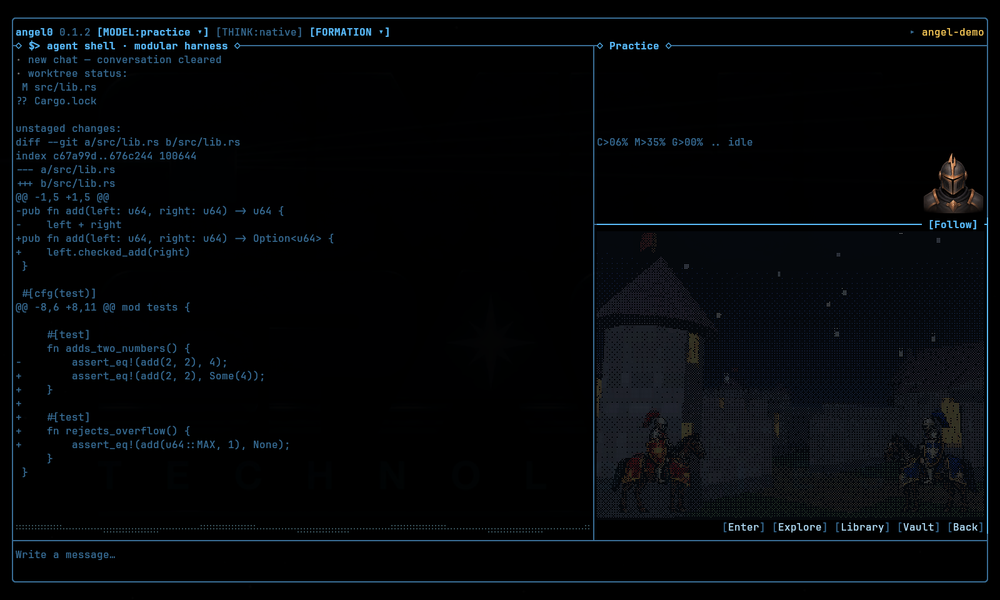

# Angel

A terminal cockpit for coding, research, and agent experiments.

Linux x86_64 · Rust 1.95.0 · MIT, with retained upstream notices.



[12 features and source links](docs/FEATURES.md) ·
[/commands](docs/COMMANDS.md) ·
[Usage images and provenance](docs/images/README.md) ·
[Attributions](THIRD_PARTY_NOTICES.md)

```sh
ANGEL_VIDEO=0 ./bin/angel0
```

Requires Rust/Cargo, a native C/C++ build toolchain, Bash and Python 3. The first
launch builds the cockpit and downloads locked dependencies, including V8. Keep
the source tree and bundled artwork with the installation. `ANGEL_VIDEO=0`
includes portraits and images; video also needs FFmpeg development libraries.

Configure a route using the [environment guide](cockpit/docs/ENV.md). API providers
require explicit enablement; without a reachable route, the practice driver is
an offline echo. The screenshots use that driver and local commands.

[Headless tasks](cockpit/docs/COMPETITION_RUNNER.md) ·
[Build and verification](docs/release-evidence.md) ·
[Contributing](CONTRIBUTING.md) · [Security](SECURITY.md) · [License](LICENSE)

Early source release. No comparative speed, cost or task-quality claims.
Approvals and confinement default on; `--yolo` disables those protections.
