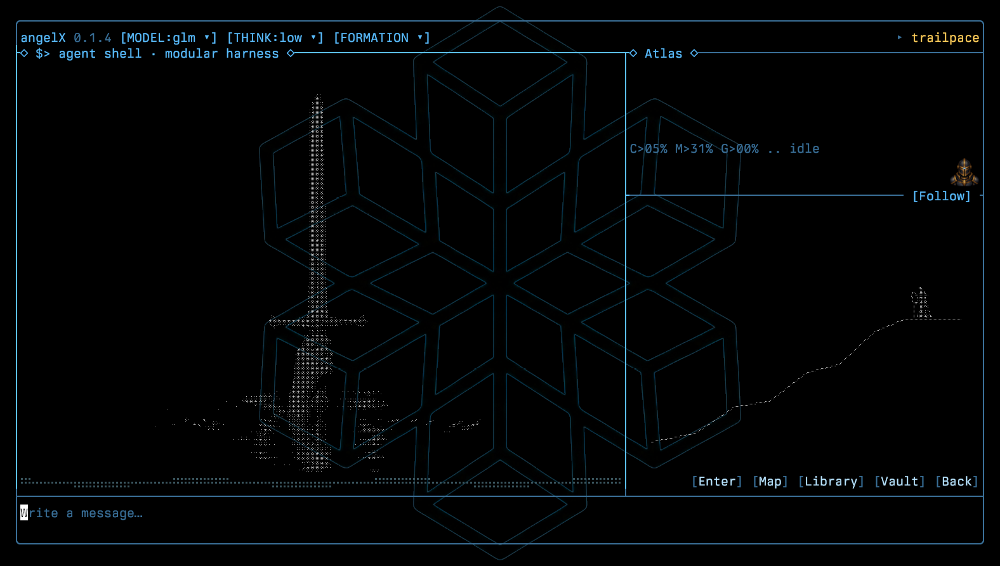

# angelX

angelX is a Rust terminal workspace for coding and research agents. It brings
model teams, code tools, persistent project memory, and measured experiments
together in one cockpit.



```sh
# Requires Linux x86_64, Rust/Cargo, C/C++ tools, Bash, Node.js and Python 3.
# The first launch builds from source.
git clone https://github.com/newjordan/angelX.git
cd angelX
ANGEL_VIDEO=0 ./bin/angel0
```

- **Models and teams** — Choose models and thinking levels, configure teams, and run agent graphs.
- **Repository tools** — Search files, inspect symbols, follow definitions, and review diffs.
- **Content-checked edits** — Hashline editing checks file content before applying anchored changes.
- **Programmable tools** — Run tool calls, loops, and filters locally in JavaScript with `code_mode`.
- **Long-session context** — Compact, deduplicate, and age retained context as work continues.
- **Project memory** — Review source-linked knowledge in Atlas and reuse it in later tasks.
- **Persistent goals** — Resume sessions and autonomous work with configurable run limits.
- **Headless runs** — Record task settings, source identity, tool activity, and acceptance evidence.
- **Measured campaigns** — Evaluate isolated attempts with verifiers and independent review.
- **Research loops** — Use Sloptomizer suggestions, Deli deliberation, and paired experiments.
- **Measured benchmarks** — Calculate measured changes from paired benchmark samples.
- **World TUI** — Introducing world tui foundations for reviewing work, building internal world models, presenting data graphs and agent behavior.

[Model setup](docs/MODELS.md) · [/commands](docs/COMMANDS.md) ·
[Feature evidence](docs/FEATURES.md) · [Attributions](THIRD_PARTY_NOTICES.md) · [MIT](LICENSE)

## Research and credits

Research and public work that informed Angel:

- [A Programming Paradigm for Spatiotemporal Composability](https://arxiv.org/abs/2608.25512) — Yifan Shi, Wei Zhang and Tianyi Cui (2026); component lifecycle, reactive dependencies and reversible registration.
- [GEPA: Reflective Prompt Evolution Can Outperform Reinforcement Learning](https://arxiv.org/abs/2507.19457) — Lakshya A. Agrawal and collaborators (2025); reflection and Pareto selection.
- [Learning, Fast and Slow: Towards LLMs That Adapt Continually](https://arxiv.org/abs/2605.12484v2) — Rishabh Tiwari and collaborators (2026); Sloptomizer's fast-context and slow-learner design.
- [Finite-time Analysis of the Multiarmed Bandit Problem](https://doi.org/10.1023/A:1013689704352) — Peter Auer, Nicolò Cesa-Bianchi and Paul Fischer (2002); UCB1 exploration.
- [Prime Agent: A Self-Improving RLM Harness](https://arxiv.org/abs/2608.23552) — Seth Karten and collaborators (2026); editable, persistent harness state.
- [RL Systems Mind the Gap: Matching Trainer and Generator Throughput](https://newsletter.semianalysis.com/p/rl-systems-mind-the-gap-matching) — Kimbo Chen, Cheang Kang Wen and Dylan Patel / SemiAnalysis (2026); rollout staleness, pruning and reward-variance guards.
- [Deli_AutoResearch](https://victorchen96.github.io/auto_research/framework.html) — Deli Chen; retained findings, fresh-context deliberation and stall recovery.
- [OpenScience](https://github.com/synthetic-sciences/openscience) — Synthetic Sciences; literature-search design. Search metadata comes from [OpenAlex](https://openalex.org), [Crossref](https://www.crossref.org), [Semantic Scholar](https://www.semanticscholar.org) and [Europe PMC](https://europepmc.org).

Code and tooling credits include [OpenAI Codex](https://github.com/openai/codex),
[oh-my-pi](https://github.com/can1357/oh-my-pi),
[DeepSeek-Reasonix](https://github.com/esengine/DeepSeek-Reasonix),
[Hermes Agent](https://github.com/NousResearch/hermes-agent),
[Prime Agent](https://github.com/PrimeIntellect-ai/prime-agent),
[Dotmax](https://github.com/newjordan/dotmax), [ureq](https://github.com/algesten/ureq),
[Ratatui](https://github.com/ratatui/ratatui),
[Crossterm](https://github.com/crossterm-rs/crossterm),
[rusty_v8](https://github.com/denoland/rusty_v8) and [V8](https://v8.dev).
File-tool interface references include [Claude Code](https://github.com/anthropics/claude-code),
[aider](https://github.com/Aider-AI/aider) and [OpenHands](https://github.com/OpenHands/OpenHands).
[Attributions](THIRD_PARTY_NOTICES.md) records implementation links, authors and
retained licenses; research inspiration and incorporated code are identified separately.
