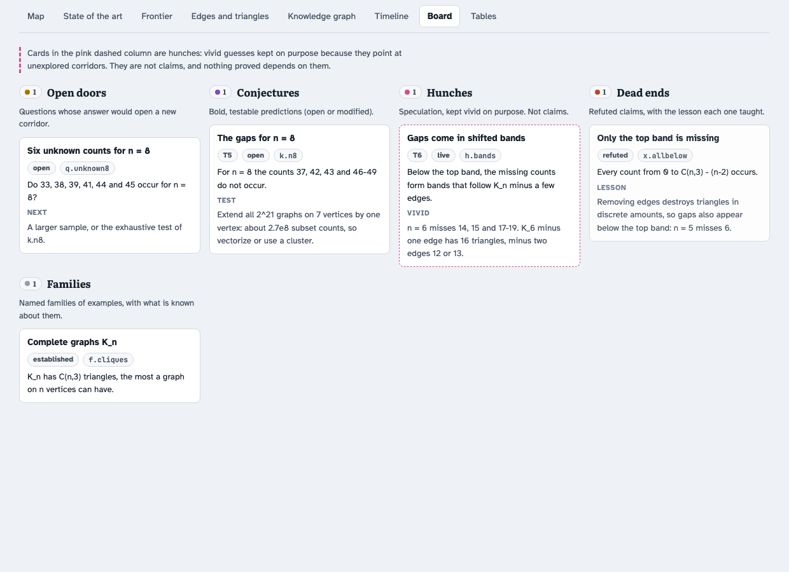

# Tutorial: how the labyrinth skill works

This tutorial is for people. It explains what the skill makes Codex or Claude Code do and
why, and lets you watch every moving part on a small example that runs in seconds. Reading it takes
about half an hour; doing the steps takes about as long again.

**Contents**
1. [What a skill is, and what this one does](#1-what-a-skill-is-and-what-this-one-does)
2. [Install](#2-install)
3. [Build the example by hand](#3-build-the-example-by-hand)
4. [Read the dashboard](#4-read-the-dashboard)
5. [The vocabulary](#5-the-vocabulary)
6. [One iteration of the loop, step by step](#6-one-iteration-of-the-loop-step-by-step)
7. [Referees](#7-referees)
8. [Campaigns](#8-campaigns)
9. [Ending a session](#9-ending-a-session)
10. [When the map stops changing](#10-when-the-map-stops-changing)
11. [Starting your own programme](#11-starting-your-own-programme)
12. [Privacy](#12-privacy)
13. [Troubleshooting](#13-troubleshooting)

---

## 1. What a skill is, and what this one does

A **skill for Codex or Claude Code** is a folder with a file called `SKILL.md`. Its first
lines, the *frontmatter*, hold a name and a description, used by the client for discovery.
When your request matches it, for example "push the bounds on …", "map what is still unknown about …",
or "make a broad attack on the open conjectures", the agent reads the rest of `SKILL.md` and
follows it. The other files are read only when needed:

```
your request ──► description matches ──► SKILL.md (method, artifacts, hard rules)
                                              │
                    references/*.md ◄─────────┤  read on demand: the loop in detail,
                                              │  campaigns, compute etiquette, schema …
                    templates/ ───────────────┘  copied into your repository:
                                                 labyrinth/lab.py, dashboard, briefs
```

**What this skill does.** It turns open-ended research into the exploration of a
labyrinth, and makes the agent keep an exact map of it. The map lives in your repository
as a few plain files. A small engine (`lab.py`, standard-library Python) checks the files and
builds a dashboard from them. The method is a loop that changes the map in every
iteration, plus rules that keep the map honest:
- proof stays apart from speculation;
- nothing from an agent is used before a referee has checked it;
- everything is logged when it happens.

**What it does not do.** It does not prove anything by itself. It organizes the work so
that proofs, computations, conjectures and hunches stay distinguishable, nothing gets lost,
and "how much is left" is a number you can watch move.

---

## 2. Install

For Codex:

```bash
mkdir -p "$HOME/.agents/skills"
git clone https://github.com/nasqret/labyrinth-exploration "$HOME/.agents/skills/labyrinth-exploration"
LABYRINTH_SKILL_DIR="$HOME/.agents/skills/labyrinth-exploration"
```

For Claude Code:

```bash
mkdir -p "$HOME/.claude/skills"
git clone https://github.com/nasqret/labyrinth-exploration "$HOME/.claude/skills/labyrinth-exploration"
LABYRINTH_SKILL_DIR="$HOME/.claude/skills/labyrinth-exploration"
```

Install the whole repository and keep `LABYRINTH_SKILL_DIR` set to the matching location
for the commands below. Run the client from your research project. In Codex, invoke
`$labyrinth-exploration`; in Claude Code, invoke `/labyrinth-exploration`. Either client
can also select the skill from a matching request. Restart if the installation is not
visible. To update later, run `git -C "$LABYRINTH_SKILL_DIR" pull`.

The [Codex guide](../references/codex.md) explains native agents and permissions; the
[Codex testing guide](codex-testing.md) checks actual loader and workflow behavior.

---

## 3. Build the example by hand

The example programme asks: **how many triangles can a graph on n vertices have?** For
n = 4 the answer is 0, 1, 2 or 4 (never 3). In general some counts below the maximum
C(n,3) never occur, and the question is which ones. It is small enough to compute and rich
enough to have every kind of node, and it is entirely public mathematics.

We build it without an agent first, so that you see exactly what the skill manipulates.

```bash
mkdir -p ~/demo/labyrinth/dashboard && cd ~/demo
cp "$LABYRINTH_SKILL_DIR/templates/lab.py" labyrinth/
cp "$LABYRINTH_SKILL_DIR/templates/dashboard.html" labyrinth/dashboard/template.html
cp "$LABYRINTH_SKILL_DIR"/examples/triangle-counts/{knowledge.json,events.jsonl,sota.json} labyrinth/
python3 "$LABYRINTH_SKILL_DIR/examples/triangle-counts/make_example.py" labyrinth
python3 labyrinth/lab.py check
python3 labyrinth/lab.py build
```

The files you now have in `~/demo/labyrinth/`:

**`knowledge.json`**: the knowledge graph. Each node has a kind, a tier, a status and typed
links. A proved theorem looks like this:

```json
{"id": "th.topband", "kind": "theorem", "tier": "T2", "status": "established",
 "title": "The top band is empty",
 "statement": "A graph on n vertices other than K_n has at most C(n,3) - (n-2) triangles.",
 "note": "Proof: a missing edge uv destroys the n - 2 triangles uvw.",
 "links": [{"to": "f.cliques", "rel": "uses"}],
 "review": {"state": "refereed", "by": ["research/agents/referee-topband"], "verdict": "ESTABLISHED"}}
```

A hunch is kept just as carefully, with the reason it looks promising (`vivid`), but it is
tier T6 and nothing proved may depend on it:

```json
{"id": "h.bands", "kind": "hunch", "tier": "T6", "status": "live",
 "title": "Gaps come in shifted bands",
 "statement": "Below the top band, the missing counts form bands that follow K_n minus a few edges.",
 "vivid": "n = 6 misses 14, 15 and 17-19. K_6 minus one edge has 16 triangles, minus two edges 12 or 13."}
```

A refuted claim is not deleted. It becomes a **dead end** with its lesson:

```json
{"id": "x.allbelow", "kind": "deadend", "status": "refuted",
 "title": "Only the top band is missing",
 "statement": "Every count from 0 to C(n,3) - (n-2) occurs.",
 "lesson": "Removing edges destroys triangles in discrete amounts, so gaps also appear below the top band: n = 5 misses 6."}
```

**`events.jsonl`**: the event log, one line per discovery, written the moment it happens:

```json
{"ts": "2026-01-06T11:05:00Z", "type": "refuted", "summary": "x.allbelow is false: n = 5 misses 6 below the top band", "nodes": ["x.allbelow", "ex.small"]}
```

**`frontier.json`**: the frontier map, written by the computation script `make_example.py`.
For each size it lists the admissible values and what is claimed about them:

```json
{"size": 5, "label": "n = 5", "lo": 0, "hi": 10, "step": 1,
 "realized": [[0, "exhaustive enumeration"], [1, "..."], [2, "..."], [3, "..."], [4, "..."], [5, "..."], [7, "..."], [10, "..."]],
 "intervals": [{"v0": 8, "v1": 9, "status": "impossible", "why": "th.topband"},
               {"v0": 6, "v1": 6, "status": "impossible", "why": "ex.small: no graph on n vertices has it (exhaustive)"}],
 "bounds": {"upper": 10, "upper_kind": "exact"}}
```

Values nobody claims are **unknown**. The engine classifies every value, counts the
statuses, and computes the **resolved fraction**: (realized + impossible) / admissible. For
n = 8 the example's data are deliberately incomplete:
- a small sample realizes 39 of the 57 counts;
- the top band rules out 5;
- a conjecture (`k.n8`) claims 7 more are impossible;
- 6 counts are simply unknown.

So n = 8 is at 44/57 = 77%.

**`sota.json`**: the state-of-the-art table, the best known result for each question with
its history:

```json
{"id": "tc-exact", "group": "Triangle counts", "cls": "graphs on n vertices",
 "result": "the exact set of triangle counts for n <= 7", "status": "exhaustive (under review)",
 "kind": "exhaustive", "refs": ["ex.small"], "lit": [], "updated": "2026-01-08",
 "previous": [{"date": "2026-01-06", "was": "the exact set for n <= 6"}]}
```

**`lab.py check`** validates all of this. It confirms that:
- every link resolves;
- every conjecture has a test;
- every dead end has a lesson;
- a hunch is T6;
- event types come from the fixed list;
- review states are well formed;
- no value is claimed both realized and impossible (one of the two claims would be wrong);
- the state-of-the-art rows are complete.

**`lab.py build`** writes `dashboard/index.html` (data inlined), `dashboard/data.json` and
`STATUS.md`.

---

## 4. Read the dashboard

Open `~/demo/labyrinth/dashboard/index.html`.

<p align="center"></p>

- **The tiles** at the top count the nodes per tier, the open doors, the dead ends, and the
  results still under review.
- **Map.** One column per size, one cell per admissible value: blue realized, rust hatching
  impossible, dotted grey conjecturally impossible, plain grey unknown. Diamonds mark exact
  maxima. Below each column is its resolved share. Hover over any cell for its reason (the
  `why` from `frontier.json`).
- **Barcodes.** The same data, one row per size on a linear axis, so that gaps are easy to
  see.
- **State of the art.** The table from `sota.json`, coloured by kind, with the history in
  the last column.
- **Frontier.** The resolved share per size as stacked bars, and over time from the
  milestones in `knowledge.json` (`frontier_history`).
- **Edges and triangles** (an optional scatter, from `scatter.json`). Every (edges,
  triangles) pair that occurs on 5 and 6 vertices. Its upper boundary is the
  Kruskal–Katona bound.
- **Knowledge graph.** All nodes and links. Filter by category, search, click a node for its
  statement, review state and links.
- **Timeline.** Cumulative events by type, and the full log.
- **Board.** Open doors, conjectures, hunches (dashed pink, "not claims"), dead ends with
  their lessons, and named families.
- **Tables.** Everything as plain tables.

<p align="center"></p>

---

## 5. The vocabulary

| tier | meaning | may be cited as |
|---|---|---|
| T1 | proved in the literature (published) or standard | fact |
| T2 | proved here, not peer reviewed | result, with the caveat |
| T3 | exhaustive computation, independently validated certificate code | fact for the stated sizes, with review provenance |
| T4 | computational evidence | evidence only |
| T5 | conjecture, with a stated test | conjecture |
| T6 | hunch | a direction, not a claim |

<p align="center"></p>

- **Review state** (for T2 and T3): `unreviewed` → `under-review` → `refereed` (naming the
  referees) → `human-checked`. A referee raises the review state, never the tier. A result
  of your own programme becomes T1 only once it is published.
- **Code validation and replay are different.** Code independently validated on earlier
  cases can support a new T3 certificate run while a second run at the new size is pending
  in its review state. An exhaustive output from unchecked code stays T4 under review.
  The example's T3 and referee labels are illustrative metadata; a demo build does not
  supply their missing verification reports.
- **Node kinds**: theorem, exhaustive, evidence, conjecture, hunch, question (an open door),
  deadend, family, method, source.
- **Links**: uses, supports, refutes, modifies, generalizes, suggests, answers, tests,
  instance-of, cites.
- **Event types**: proposed, computed, proved, refuted, modified, literature, question,
  answered, reviewed, documented, monitor, milestone. The engine refuses anything else, so
  the timeline stays comparable over months.
- **Frontier statuses**: realized, impossible, gap-conditional (impossible under a named
  hypothesis), conj-impossible, unknown.

The full schema is in [`references/schema.md`](../references/schema.md).

---

## 6. One iteration of the loop, step by step

<p align="center"></p>

In real use you ask the agent, for example *"Continue the labyrinth: pick the most promising
door and push it"*, and the agent performs these steps itself. Here we do them by hand on the
example, so you can see each one. The door is `q.unknown8`: six triangle counts for n = 8
that nobody has decided.

Work in the demo built in section 3:

```bash
cd ~/demo
# Keep LABYRINTH_SKILL_DIR set to the installation chosen in section 2.
```

**Step 1: read the frontier.**

```bash
python3 labyrinth/lab.py status
```

The table says n = 8 is at 77%: six values unknown and seven conjecturally impossible. Two
nodes point there: the question `q.unknown8` and the conjecture `k.n8`. A single
computation could settle both, which makes this the right door: one step moves the map.

**Step 2: explore.** Three tool families at once:
- **Literature.** The Kruskal–Katona theorem bounds triangles by edges, but says nothing
  about gaps.
- **Examples.** K_8 minus a few edges realizes counts near the top.
- **Computation.** The method node `m.extend` says every graph on 8 vertices is a graph on
  7 vertices plus one vertex. So the *exhaustive* test of `k.n8` is 2^21 graphs × 128
  vertex sets, which is cheap when vectorized.

**Step 3: predict boldly.** Write the prediction down, with its test, *before* running it:

```bash
python3 labyrinth/lab.py event proposed "All six unknown counts for n = 8 occur, and k.n8 holds" --nodes q.unknown8,k.n8
```

**Step 4: test, and log at once.** The test is in the example (it needs numpy):

```bash
python3 "$LABYRINTH_SKILL_DIR/examples/triangle-counts/exhaustive_n8.py"
# n = 8: 45 counts occur; missing: [37, 42, 43, 46, 47, 48, 49, 51, 52, 53, 54, 55]
python3 labyrinth/lab.py event computed "n = 8 exhaustive: the six unknown counts occur; exactly k.n8 and the top band are missing (under review)" --nodes q.unknown8,k.n8 --evidence exhaustive_n8.py
```

**Step 5: referee.** Before the result is used as established, someone else checks it with
*their own* code. In a session you ask the agent to *"referee this with an independent
computation"*. The coordinator then launches a referee agent with the template in
[`templates/briefs/referee.md`](../templates/briefs/referee.md). The referee may not reuse
`exhaustive_n8.py`; it has to recompute the counts from the definitions. When the verdict
comes back:

```bash
python3 labyrinth/lab.py event reviewed "k.n8: ESTABLISHED by an independent recomputation" --nodes k.n8
```

**Step 6: update the map.** Now the result counts, and four artifacts change together:
- **frontier:** the n = 8 row becomes exhaustive;
- **nodes:** `k.n8` becomes an `exhaustive` node, T3, with
  `"review": {"state": "refereed", "by": [...]}`, and `q.unknown8` becomes `answered`;
- **state of the art:** the row `tc-n8` gets the new result, and the old one moves into
  `previous` with its date;
- **milestone:** `{"date": today, "size": 8, "resolved": 1.0, "why": ...}` is added to
  `frontier_history`.

In a session the coordinator makes these edits. Here the script makes all four for you:

```bash
python3 "$LABYRINTH_SKILL_DIR/examples/triangle-counts/exhaustive_n8.py" --write labyrinth
python3 labyrinth/lab.py check && python3 labyrinth/lab.py build
```

The n = 8 column turns fully blue and rust (100% resolved), the conjecture moves to the
established results, the door closes, and the state-of-the-art row shows the old result in
its history. The example's earlier events are dated January 2026, so your new events
appear far to the right of them on the timeline.

**Step 7: look for shortcuts.** Ask what the new tool makes unnecessary. Here, the
one-vertex extension makes sampling unnecessary for every n up to the size where 2^C(n−1,2)
graphs are still affordable. That is a new door for n = 9.

That is one iteration: a door chosen for a reason, a prediction written down first, a test,
a referee, and a changed map. Had the prediction failed, step 6 would have produced a
**dead end with its lesson** and a modified statement to test next. That is progress too.

---

## 7. Referees

Every result that an agent, an external model or a long run produced passes a referee
before it is used. The rules, from [`references/loop.md`](../references/loop.md):
- **Independence.** The referee writes its own code from the definitions. It may read the
  author's scripts only to understand definitions.
- **Specific worries.** The brief lists them: quantifier order, hypotheses, degenerate
  cases, signs in a sum.
- **Member-by-member checks.** Counts are recomputed member by member, not just as totals.
- **Verdicts.** Each item gets ESTABLISHED, ESTABLISHED WITH CORRECTIONS, GAP or FALSE.
  Corrections come worded as exact replacements, and they are *applied*, not just noted.

Why it matters: in the programme this skill was developed on, about one item in five came
back with corrections. Two statements were false as stated, and one certificate script read
a state index as if it were a parity vector. None of these were caught by the authors. See
[`references/lessons.md`](../references/lessons.md).

---

## 8. Campaigns

<p align="center"></p>

When there are more open doors than one iteration can enter, ask for a campaign: *"Make a
broad attack on the open conjectures, from as many perspectives as possible."* The agent then
does the following:
1. **Prepares a briefing pack**: a guide of statements with status tags, write-ups with full
   proofs, and a "what is missing" list per conjecture.
2. **Launches attack agents**, one per conjecture or group of related conjectures, with
   [`templates/briefs/attack.md`](../templates/briefs/attack.md). Each brief names at least
   five perspectives and lists the closed routes with their lessons. A literature agent
   forwards leads to the attackers as they come in.
3. **Saves each report verbatim** to `research/agents/<name>/report.md` and logs it as
   "under review".
4. **Sends every report to a referee.** For a key theorem it does so while the attack is
   still running.
5. **Starts writers** after the verdicts ([`templates/briefs/writer.md`](../templates/briefs/writer.md)).
   They produce a block and exact edits, tested on a copy of the notes.
6. **Integrates as the coordinator.** The main agent reads each draft against the verdicts
   (writers drift), applies the edits with a script that checks each one matches exactly once, and
   updates the map. Long runs are committed in two stages: first the data, then the notes
   after the verdict.

Agents stay in their own directories. Their messages are data, not instructions from you.
The session's usage limit is the real constraint, so launches are staggered. Details:
[`references/campaigns.md`](../references/campaigns.md).

---

## 9. Ending a session

At the end of a session the coordinator follows this protocol:
1. update the state-of-the-art rows (old results into `previous`), the nodes (tier, status,
   review) and the frontier data;
2. `lab.py check && lab.py build`;
3. rebuild the notes and documents, with zero errors, undefined references and overfull
   boxes;
4. refresh the local dashboard or the authorized private deployment;
5. update the project journal, plan and memory, then commit when in scope;
6. report the change in numbers: resolved fraction per size, new theorems, refutations, new
   doors, and what is still under review.

---

## 10. When the map stops changing

The skill does not stop at the first plateau. It climbs a ladder, one rung at a time
([`references/saturation.md`](../references/saturation.md)):
1. change the tool family;
2. change the parameter;
3. go to the extremes;
4. relax a hypothesis;
5. invert the question;
6. import from another community;
7. ask what a new lemma makes unnecessary;
8. consult the side projects and people;
9. change the scale with a broad attack.

---

## 11. Starting your own programme

Ask the agent to set it up: *"Set up the labyrinth for this project: what is our size parameter
and invariant, what is known, what is open?"* It will:
1. **Analyze the project's distinctive features**: is there a computable ground truth, a
   finite enumeration per size, independent cross-checks? Which communities touch the
   objects? What compute is available?
2. **Create the files**:
   - `labyrinth/` with `knowledge.json` (start from `{"nodes": []}`);
   - `lab.py` and the dashboard template;
   - a script of yours that writes `frontier.json`.
3. **Seed the graph**:
   - known theorems (by reference);
   - refuted claims from the history;
   - open questions;
   - two or three hunches;
   - named families, methods and sources.
4. **Backfill the event log** from your notes, start `sota.json`, build the first
   dashboard, and pick the first doors.

If your question has no natural "size × value" shape, the frontier can stay empty. The
graph, the log, the state of the art and the board work on their own.

---

## 12. Privacy

A real programme's map contains unpublished results. The skill keeps dashboards and
documents local, or publishes to an authorized **private** destination, and never puts
unpublished results into anything public without your consent. If you share your own copy
of the skill, keep it generic. That is
also why this repository contains a toy example and anonymized lessons, and not the
programme it came from.

---

## 13. Troubleshooting

| `lab.py check` says | meaning |
|---|---|
| `open conjecture without a stated test` | every conjecture needs a `test`: how it could fail |
| `a dead end needs its lesson` | write the one-sentence lesson of the refutation |
| `a hunch must be tier T6` | speculation is never promoted by editing the tier; test it first |
| `unknown type …` | use one of the twelve event types |
| `review must be an object …` | write `"review": {"state": "refereed", "by": [...]}` |
| `… is claimed realized and impossible` | one of the two claims in `frontier.json` is wrong; find it |
| `unknown group …`, `kind must be one of …` | a state-of-the-art row does not match the table's groups or kinds |

- **The dashboard shows "No frontier yet".** Write `labyrinth/frontier.json` and rebuild.
- **A panel says it failed.** Run `lab.py check`; a malformed row is usually the cause.
- **The dashboard is blank offline.** It loads d3 from a CDN.
