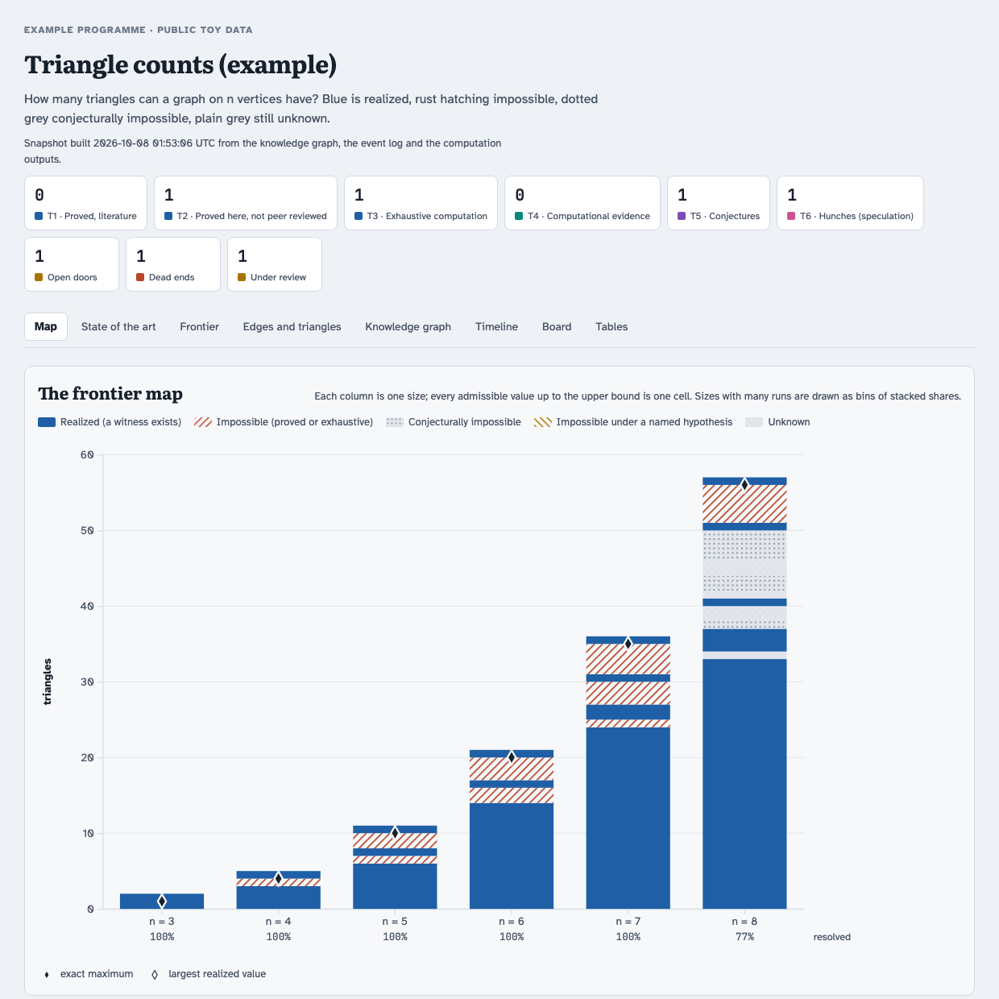

# Examples

| example | what it shows |
|---|---|
| [`triangle-counts/`](triangle-counts/) | A complete, runnable programme: how many triangles can a graph on n vertices have? It has every kind of node (theorem, exhaustive result, conjecture with a test, hunch, open door, dead end with its lesson), a frontier map, a state-of-the-art table with history, a result under review, and a scatter. Builds in seconds with Python 3. |
| [`triangle-counts/exhaustive_n8.py`](triangle-counts/exhaustive_n8.py) | One real iteration of the loop: the exhaustive test that settles the example's open door for n = 8 (needs numpy). The [tutorial](../docs/tutorial.md#6-one-iteration-of-the-loop-step-by-step) walks through it. |
| [`prompts.md`](prompts.md) | What to say to Codex or Claude Code, and what the skill then makes it do. |
| [`../templates/briefs/`](../templates/briefs/) | Fill-in briefs for attack agents, referees and writers, as used in campaigns. |

  

