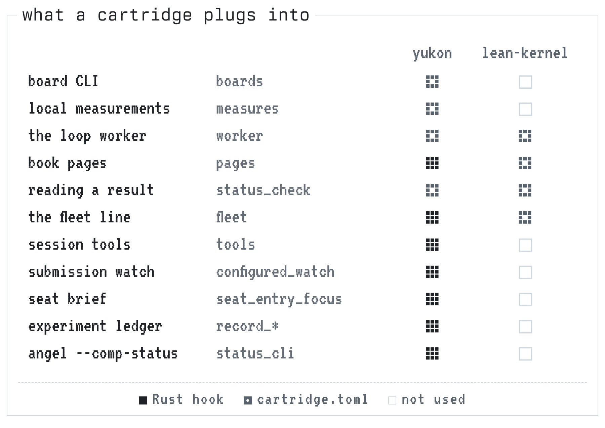
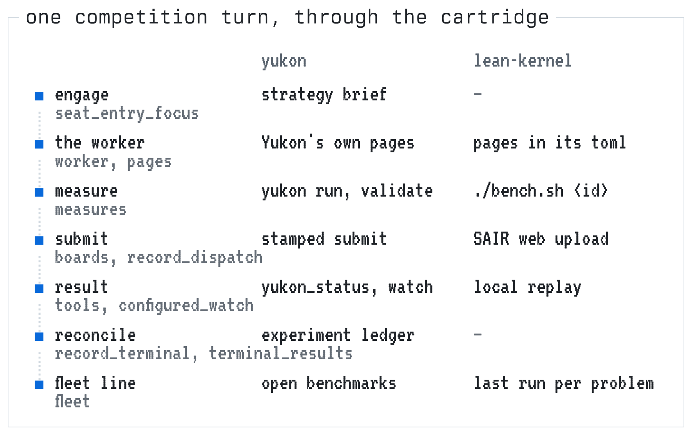
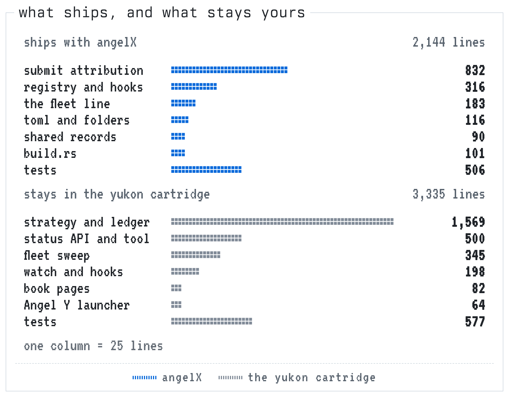

# Cartridges

angelX ships the competition engine: the loop, the submission watcher, the
fleet line on the loop HUD, truthful `--model`/`--harness` attribution on board
submissions, and the book of behaviors. A **cartridge** plugs one competition
into that engine: its board CLI, its loop worker's brief, its status API, its
book pages. Cartridges are yours. They live outside the angelX tree, so a
private setup never ships with the harness.

<picture>
  <source media="(prefers-color-scheme: dark)" srcset="images/cartridges/slot-dark.png">
  
</picture>

## Plugging one in

Put the cartridge's folder in `~/.angelX/cartridges/`, or point
`ANGEL_CARTRIDGES` at it (a path list; each entry is a cartridge or a folder of
them). The first cartridge found is active; `ANGEL_CARTRIDGE=<id>` picks
another. `angel --build-info --json` lists the cartridges a binary carries.

With no cartridge plugged in, the engine runs on its own: competition loops,
the watcher and the HUD work, and the book names only the platform CLI.

## How Yukon uses it

Yukon is the operator's own cartridge, and the reason the slot exists. It is a
source cartridge: a `cartridge.toml` plus Rust that the build compiles in. It
lives in `~/.angelX/cartridges/yukon`, a private repository of its own, and
none of it is in this tree.

- **The toml** names the board CLI (`yukon`, installed as `hilbert` too), the
  local measurements (`yukon run`, `yukon validate`), the worker's page, and how
  a result is read (`yukon_status or the platform CLI`).
- **The Rust** adds the `yukon_status` tool, the authenticated status API behind
  a live submission watch, the fleet sweep across every open benchmark, the
  seat's strategy brief and its experiment ledger, `angel --comp-status`, and
  the book pages that name all of it, in the words they had before cartridges.
  A golden test holds those pages to the old text.
- **Angel Y**, the pinned competition launcher, ships inside the cartridge and
  refuses a binary built without it.

Every turn of a Yukon loop passes through the cartridge at seven points:

<picture>
  <source media="(prefers-color-scheme: dark)" srcset="images/cartridges/turn-dark.png">
  
</picture>

What the split moved, measured in lines (data in
[`cartridges.json`](images/cartridges/cartridges.json)):

<picture>
  <source media="(prefers-color-scheme: dark)" srcset="images/cartridges/lines-dark.png">
  
</picture>

## Another competition: the Lean Kernel Challenge

[The Lean Kernel Challenge](https://competition.sair.foundation/competitions/lean-kernel-challenge)
(Lean FRO and the SAIR Foundation; submissions close 2026-11-20) asks for
verified computation: for each problem, an algorithm `impl` and a proof
`impl_correct` that it matches the specification for every input. The rank is
the sum of per-case median kernel instruction counts, lowest first.

[`examples/cartridges/lean-kernel`](examples/cartridges/lean-kernel/) is that
competition as a config-only cartridge, written from its public rules and
starter repository. It has not been run on the live challenge.

- **No board to stamp.** Submissions go through the SAIR web platform, so
  `boards` is empty.
- **The worker's pages are data.** `[[pages]]` in the toml give the loop worker
  its brief at `⠻⠊`, the same address Yukon's Rust pages use.
- **Measuring.** `bench.sh` proves a candidate with `lake build`, then replays
  it in the kernel with the challenge's `evaluation/run.py`. angelX already
  counts a `bench*` script as a measurement.
- **The fleet line.** `fleet.sh` reads each problem's latest local evaluation.
- **When to add Rust.** To read the official leaderboard, watch a submission, or
  keep an instruction-count ledger, the cartridge would grow a `src/` with
  those hooks, as Yukon's did.

## A config-only cartridge

A folder holding one `cartridge.toml` is a whole cartridge. It is read at
startup; nothing is rebuilt.

```toml
id = "kernelbench"
label = "KernelBench"
# The board CLI's program names. `<board> submit` gets angelX's own --model and
# --harness; `<board> submit|submissions|status|list` count as outcomes.
boards = ["kb"]
# `<board> <sub>` commands that are local measurements.
measures = ["run", "validate"]
# The loop worker's brief: a page address, defined below.
worker = "⠻⠊"
# How the prompts name reading a submission's result.
status_check = "`kb status` or the platform CLI"
# The fleet line: a command printing one snapshot. It runs in the session's
# directory; ANGEL_CARTRIDGE_DIR names this folder.
fleet_command = "\"$ANGEL_CARTRIDGE_DIR/fleet.sh\""
fleet_interval_secs = 45

[[pages]]
route = "⠻⠊"
name = "kernelbench"
signal = "the KernelBench loop worker"
pages = ["You are a competition loop worker on KernelBench."]
```

`fleet_command` prints:

```json
{"benchmarks": 2, "failed": 0,
 "submissions": [{"benchmark": "kb/softmax", "id": "a1b2", "status": "validating", "score": null}]}
```

## A source cartridge

Add `src/mod.rs` beside the toml and the cockpit's build compiles the folder
in as a module. It exports `pub(crate) static HOOKS`, an implementation of
`Hooks` (`cockpit/src/agent/harness/cartridges/mod.rs`). Every hook is
optional:

| Hook | What it gives the competition |
|---|---|
| `tools` | Tools added to every session (a status reader, say) |
| `research_tools` | Which of those long research always sees |
| `pages` | Book pages: new routes, or the competition's own wording of a route |
| `configured_watch` | A live submission watch the operator configures |
| `fleet_sweep` | The fleet line, in Rust |
| `seat_entry_focus` | Evidence carried inline when a competition turn engages |
| `record_dispatch`, `record_terminal`, `terminal_results` | A durable experiment ledger the loop reconciles against |
| `status_cli` | `angel --comp-status ARGS…` |

A source cartridge can use anything in the cockpit crate. Rebuild after
changing it; the build watches its files. A source cartridge that a binary was
not built with is ignored at startup rather than run without its hooks.
