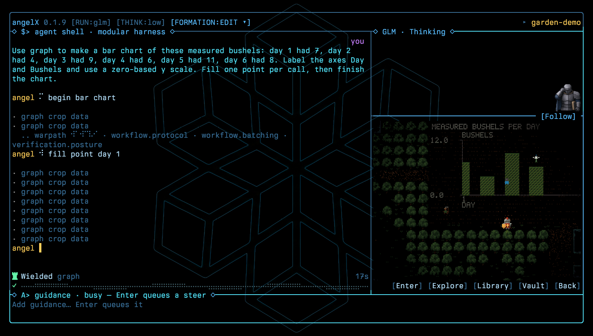
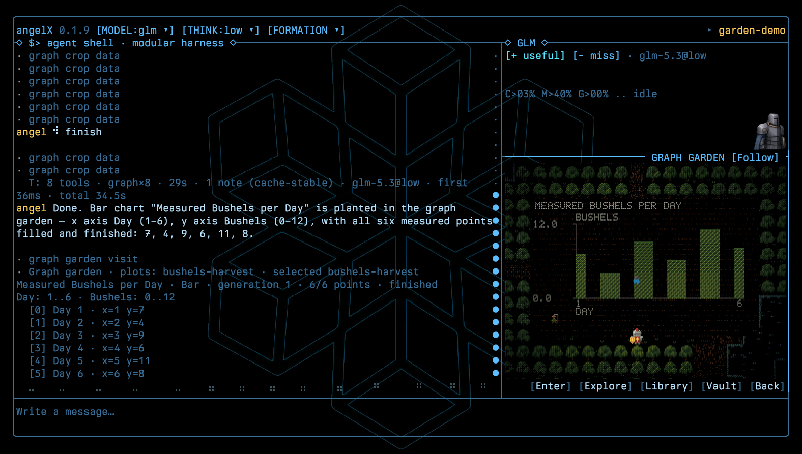
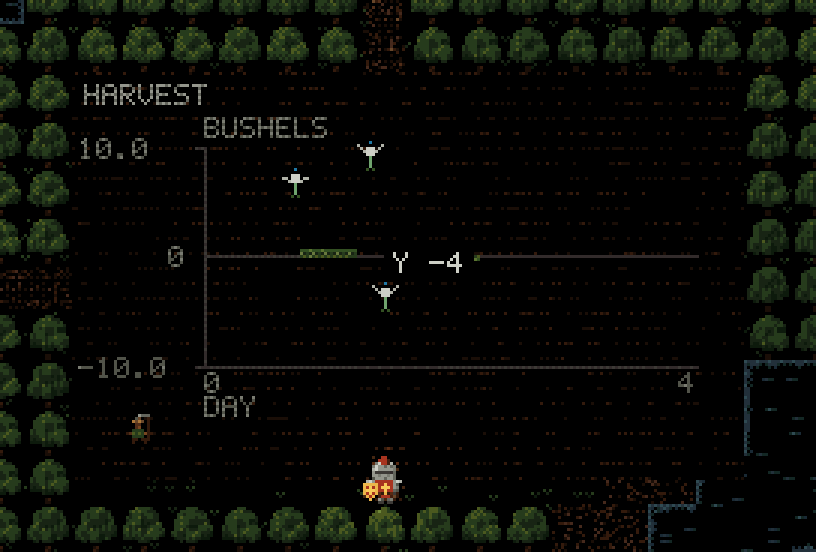

# Graph garden in the world

Available in angelX 0.1.9.

The graph garden turns actual chart work into a place in the mini-viz realm.
The harness prepares soil, asks for specific data points, and finishes a
chart. A farmer coordinates each request and a winged sprite delivers its
result. Bar charts grow crop beds, line charts grow connecting vines, and
scatter plots grow flowers at the supplied coordinates.





Both are unedited captures of angelX 0.1.9 on GLM-5.3 (thinking low), from one
live turn with the prompt shown below. The fixture preview further down comes
from the production overworld renderer using test data.



The `graph` tool implements those operations. Sprites are tied to real
tool-call IDs, including nested code-mode IDs. Crops grow only from the full
structured receipt of a successful call. Activity-summary text has no
authority to supply chart values. Fetching or measuring an observation still
uses the appropriate existing tool; planting it is a distinct `graph` point
call. The animation does not invent a separate retrieval call for each value.

## Visit and regrow a chart

Ask angelX to chart supplied or measured data using the `graph` tool. It is
registered in ordinary workspace tool registries and discoverable through
`tool_search` when the harness uses a reduced tool catalog. For example:

> Use graph to make a bar chart of these measured bushels: day 1 had 7,
> day 2 had 4, and day 3 had 9. Label the axes Day and Bushels and use a
> zero-based y scale. Fill one point per call, then finish the chart.

The working knight heads to the fields and remains there until another
ordinary tool sends him elsewhere. The graph remains planted after the
animation ends. `/world visit garden` points the camera at the farm without
changing ongoing work. `/world crops` visits the garden and reports its exact
values, scales, generation, and completion status. `/world crops <plot-id>`
selects another retained plot; `/world follow` resumes following the knight.

Begin again using the same plot ID to replace the old graph with dirt and
grow a new generation. `clear` leaves bare dirt. Both spells require a
successful tool mutation. A failed request leaves the existing chart intact.
Old-generation point calls are rejected, and late receipts cannot restore a
superseded crop. Farmers ask `X=...?`; sprites answer with the returned `Y`
or `NO DATA`. These speech cues replay the actual request and outcome.

## Tool contract

`begin` specifies a chart, its axes, and its expected point count. Its receipt
returns the generation needed for later operations:

```json
{
  "op": "begin",
  "plot": "harvest",
  "spec": {
    "title": "Measured harvest",
    "kind": "bar",
    "x_label": "Day",
    "y_label": "Bushels",
    "x_min": 0,
    "x_max": 4,
    "y_min": 0,
    "y_max": 10,
    "expected_points": 3
  }
}
```

Each point call fills one indexed observation. Use the generation returned
by your own `begin`, rather than assuming it is always 1:

```json
{
  "op": "point",
  "plot": "harvest",
  "generation": 1,
  "index": 0,
  "point": { "label": "Day 1", "x": 1, "y": 7 }
}
```

After supplying indices 0, 1, and 2, call
`{"op":"finish","plot":"harvest","generation":1}`.
Finishing rejects missing points. Replacing an existing index is allowed
while growing; modifying a finished chart requires a new `begin`.

There are at most four retained plot IDs and 32 points per plot. The camera
shows one selected plot on the existing field terrain. Coordinates must be
finite, within ±1e12, and inside the declared domains. Domains must increase;
bar chart y scales must contain zero. Out-of-domain data is rejected instead
of silently clamped. Labels are bounded and reject controls and direction
overrides. Plot IDs contain lowercase letters, digits, and hyphens.

The garden uses the existing realm palette, farmer art, terrain renderer,
and terminal image or half-block presentation. Negative bars grow below the
visible zero line. Points and vines use the declared coordinate scales.
Missing observations remain empty. The tiny world font abbreviates long
labels; the report preserves their exact text and values.

## Native events and animation

Serial, parallel, and nested code-mode dispatch paths emit dedicated
`GraphCrop` events around the actual tool call. Ordinary `ToolResult` events
close failed, denied, cancelled, and unreceipted requests. Receipts carry the
authoritative plot snapshot and revision; the latest revision wins. Repeated
receipts cannot restart growth. In code mode, a mutation that succeeded
before an outer output-budget failure still supplies its native receipt.

The UI retains graph data even while Stage is hidden, without ticking the
hidden world. Sprite delivery and crop growth use bounded world-tick
windows. Reduced or disabled motion shows settled crop geometry. Empty and
settled gardens keep a stable garden frame, allowing the world to park.
Animation history is bounded independently of chart storage, so a long
hidden-stage session keeps accepting updated data.

Chart data is held in memory for the workspace tool-registry session; this
change does not add save files, chart export, point picking, remote friends,
or automatic extraction from arbitrary PNG/SVG charts. The graph tool has
no filesystem, network, or arbitrary-code execution capability.

## Code and verification

- `cockpit/src/knowledge/graph_crop.rs`: chart contract and bounded mutations.
- `cockpit/src/agent/tools/graph.rs`: native tool and full event emission.
- `cockpit/src/stage/world_viz/overworld/garden.rs`: correlated calls, crop
  geometry, growth, dirt reset, farmers, and sprite dialogue.
- `cockpit/src/app/control/turn_io.rs`: event retention and failure settlement.

The tests cover actual harness and nested code-mode dispatch, hidden-stage
event draining, incomplete charts, negative values, generation changes,
failed and duplicate receipts, bounded retention, deterministic world
rendering, knight arrival, and idle settling. Set
`ANGEL_GRAPH_GARDEN_REVIEW=/tmp/angelX-graph-art-review` for the
`graph_crop_preview_exports_real_world_frames_for_art_review` test to export
bar, line, and scatter world frames for visual inspection.

The focused `graph_crop` filter passes 19 tests. The existing world suite
passes 296 tests with 15 existing review tests ignored; the stage suite passes
9 with one ignored, the code-mode suite passes 14, and the command suite
passes 26. Some suites overlap with the focused filter. The offline binary
build and its `--help` smoke check pass. Repository formatting,
source connections, and the active-product boundary checks pass. Strict
Clippy still reports 45 pre-existing error locations, including untouched
lines in the farmer kit; none is in added or modified code. The full quality
gate therefore remains blocked by baseline lint failures.
