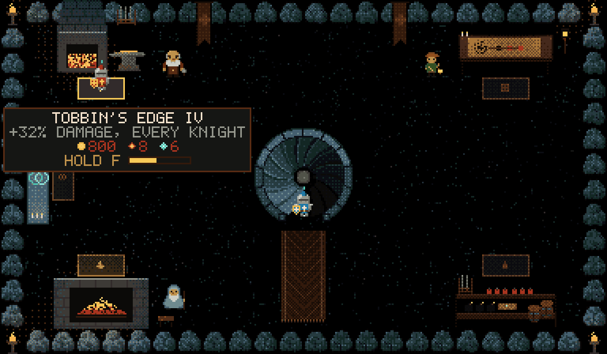
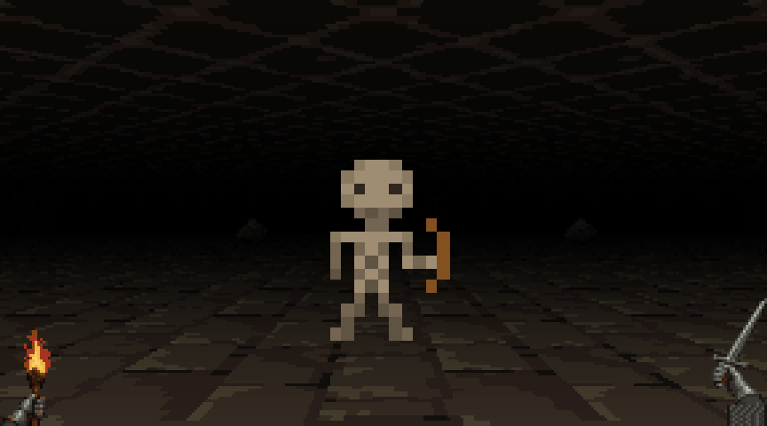
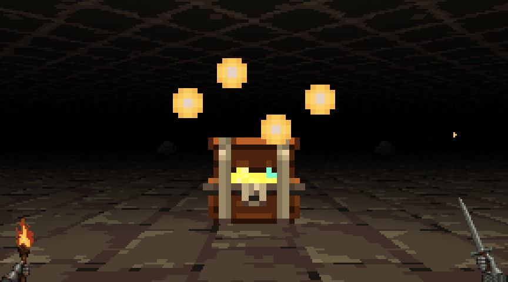
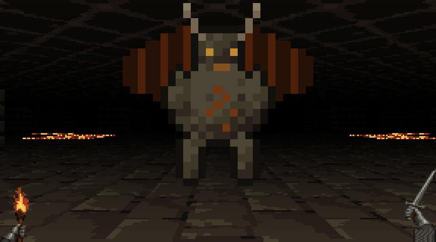

# angelX 0.2.0

The Delve grew into a realm worth coming home to. Your loops walk it now, and
the harness underneath got a full repair pass.

## Upgrade

```sh
angelX update
```

Or install fresh with the one line in the [README](../README.md). From a source
checkout, `git pull` and run `./bin/angelX` again.

## The realm under the Delve

`/dungeon` still walks your knight to the Delve's gate, and friends still join
from their own angelX with `/dungeon join`. If you want people without angelX
to watch, `/dungeon_host --view` lets an invitation open a read-only view of
the floor in a browser. What waits below is new.



- **The Undercroft.** Every delve begins at home, in the company's cellar
  under the gate. Spoils carried up the Winding Stair build Tobbin's forge,
  Blaise's hearth, the rack, the Chapel of Bonds and Wren's map table, rung by
  rung. What is built stays built, and friends see the same cellar.
- **Dame Fortune's Wheel.** One spin a delve picks its mode: Lights Out,
  Giant's Feast, Mimic Fair, the Collapse, Glass Jaw, Hold the Stair, the
  Gauntlet of Guardians, Turbo, Rune Rush, All Random, Ironman, Hollow Walls,
  Sponsors' Night, or the Long Way Down as it always was.
- **The deep.** The dragon no longer ends the delve. Its lair opens on a light
  home and on the stairs down: the Drowned Archive, the Fungal Deep, and the
  Unknown, where the Grail is.
- **Knights that grow.** Everything the party fells is experience. Sir Ector
  teaches a talent at every level, and every knight carries an ultimate on R.
- **More to find.** Power runes in a third of fights, cracked walls with vaults
  behind them, cages to open and people to bring home, and the Pit, where the
  Pit Tyrant keeps the Talisman.
- **More to fight.** A second company (sappers, slimes, necromancers,
  warboars, hobs, shamans, hexers and a loot goblin), the deep's hunters, and
  floor chiefs whose strength comes from the resources of their floor: a hive,
  rival clans, or a stronghold that pays tribute.
- **The west wing.** Dig out the Trophy Hall's rubble for Maud's tavern, the
  Siege Perilous: her rounds and Sir Dinadan's songs for the next delve,
  Beaumains for hire, a rumour board, and a chair only the worthy may sit in.
- **A realm that keeps score.** The Trophy Hall and Sir Kay, the Herald's
  achievements and his coffer, Fortune's dares and her audience, Wren's
  bounties, the Herald's Bestiary, and Merlin, who tells you the one thing most
  worth doing next.
- **Company at home.** Lady Tallow, Blaise's cat, comes down the stair with
  you. Grubbins, the goblin who came back, keeps a stall in the Training Yard.

Every name in the Delve is the realm's own. The full guide is
[The Delve](DELVE.md), and the world behind it is [the lore](DELVE-LORE.md).

## Your loop walks the crawl

While a `/loop` runs, the Realm pane is a first-person crawl through a floor of
the Delve: a step at a time, a torch in the left hand, a sword in the right.
The loop's iterations, time and tokens stay under the picture.

<p>
  
  
  
</p>

- The loop picks the floor: coding and competition loops go down the Mines,
  research goes to the Fungal Deep, and a submission being judged stands in
  Dragon Keep.
- What the agent's tools do is what the party does: editing is a fight,
  reading is study at a lectern, planning is a word with the realm's folk, and
  an idle hall is a campfire.
- A measurement is a chest found and a stall a guttering torch. A judged
  submission brings the floor's guardian out of the stone. A beaten record is
  a fight the party wins; anything else is a retreat.

The crawl is presentation only: it creates no iterations, measurements or
rewards. `ANGEL_LOOP_VIEW=expedition` brings back the earlier expedition walk.
Details: [the world adventure](world-adventure.md).

## Loops leave a settlement

Long loops leave something behind in the player's hall. Completed, saved loop
iterations excavate new rooms, furnish them and craft site tools. The loop's
first-person survey and a new Delve both use the same saved floor.

1. Run a normal `/loop` in the workspace. Watching does not build; finished
   iterations do.
2. `/dungeon settlement` visits the site, with no Delve open. Walk west from
   the player hall.
3. When a worker has written a real research report and its manifest,
   `/dungeon deposit <name>` places it as an exhibit.
4. Stand beside **LOCAL RESEARCH** and press **E** (or `/dungeon inspect`) to
   read it. Guests see the exhibit's place, not its text.

## The stables and the lists

A small local practice game in the mini-world and the Delve's home. It has no
model calls and no rewards.

| Command | Effect |
|---|---|
| `/world visit stables`, `/world visit tournament` | Focus the 3D stables or the lists in the mini-world. |
| `/dungeon stable select Bramble\|Cinder\|Mist` | Pick a mount: Bramble guards, Cinder charges, Mist aims. |
| `/dungeon stable tend` | Brush, water and check tack for a first-pass point. |
| `/dungeon tournament start` | Start a three-pass match against the rival knight. |
| `/dungeon tournament round <1..3> guard\|aim\|charge` | Ride the next pass. Guard beats charge, charge beats aim, aim beats guard. |
| `/dungeon tournament leave`, `/dungeon stable leave` | Close practice. |

In the Delve's practice overlay, `1`/`2`/`3` pick a mount, `E` tends, Enter
starts a match, `G`/`A`/`C` choose the pass, and Esc leaves.

## The research labyrinth

`/labyrinth init` starts a research map in the workspace: questions, evidence,
proofs and refutations, with established results as corridors, refutations as
walls and open questions as doors. Deli's findings, `/loop` observations,
Sloptomizer experiments and RL campaign receipts are written to it, and agent
turns see the few doors most worth checking next.

```text
/labyrinth init
/labyrinth status
/labyrinth check
/labyrinth frontier
/labyrinth plan
/labyrinth route <from> <to> [established]
```

**Campaigns.** A campaign takes doors off the map and works them the whole way
through, in angelX's own turns: a literature pass, an attack from several
angles, an independent referee who gets only the claim and the evidence and
re-runs the checks in the sealed sandbox, and a writer whose edits must match
the referee's corrections before they reach the map. Start one with
`angel --labyrinth campaign start <spec>`, or let a loop do it through the
`labyrinth_campaign` and `loop_research` tools.

**The map shapes the world.** Each loop iteration saves the plan the map gave
it, and the settlement digs by that plan: which front to open and what kind of
room it becomes. From the third floor down, the Delve lays out its tunnels as
galleries, warrens and karst.

The map is plain JSON with a standard-library Python engine and a dashboard you
open locally. It is adapted from Bartosz Naskręcki's
[Labyrinth Exploration](https://github.com/nasqret/labyrinth-exploration), whose
upstream skill, briefs, examples and tests ship pinned beside it.
Details: [the labyrinth guide](LABYRINTH.md).

## Under the hood

**A repair pass across the harness.** 34 reviewed fixes, qualified on macOS and
Linux with the full Rust suites, sandbox probes and release-build smoke tests:

- **Cancellation.** Stop reaches a turn waiting on an integration lock. A
  handoff restart waits for the foreground turn to finish, and keeps the queued
  request and history.
- **Persistence.** A loop's stop or pause reports a failed checkpoint instead
  of losing state. A failed realm or home save keeps pending rewards for the
  retry, and a failed fork save leaves the session intact. Concurrent knowledge
  graph writes reload under the store lock.
- **Sandbox boundaries.** Cargo credential files stay out of the sandbox, and
  approved toolchains stay readable.
- **Platform identity.** On macOS, process identity checks fail closed, and a
  busy child process is told apart from an idle one.
- **Tools.** A split commit stages only its own paths. A pending asynchronous
  `code_mode` promise is an error, not an empty success. Web results say when
  they were truncated. Grok sign-in refreshes on the first request, so startup
  registers Grok faster.
- **The interface.** Every live slash command has completion and help. Model
  portraits follow the served model's family.

**A cut-off reply is asked again.** When a reply is stopped at the output cap
with no tool call, it goes back to the model instead of standing as the answer.

**The compaction helper keeps the turn moving.** With a Treebeard helper model
set up, its digests roll in without holding the step, a long tool call hands
off, and a helper host that disappears no longer freezes the turn.

**A watch on long loops.** A wedged loop iteration gets a soft check at 30
minutes and a harness-only review at 60.
