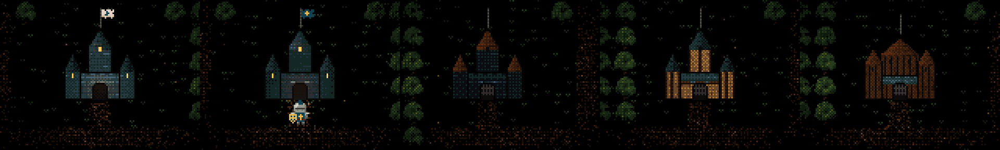
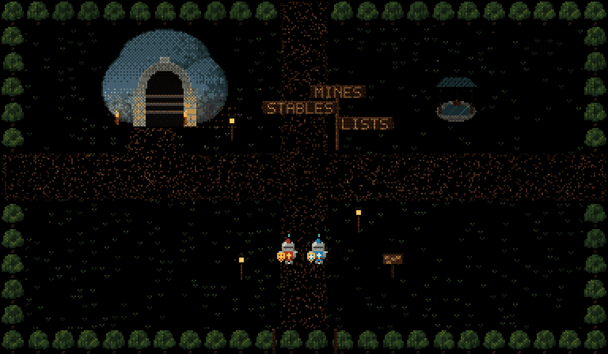
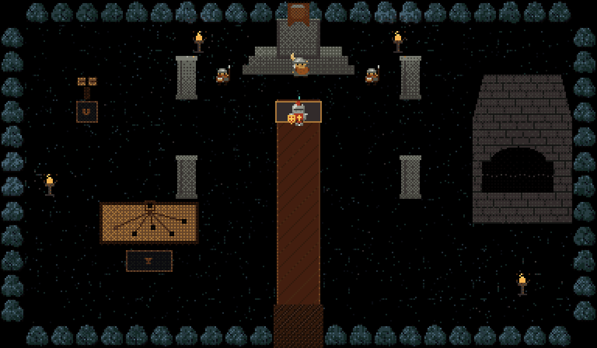

# angelX 0.2.1

The realm grew outward. A castle now stands for every model that serves, the
world above the Delve has rooms of its own and a dwarf king to rule under it,
and a friend can join from a browser with nothing installed.

## Upgrade

```sh
angelX update
```

Or install fresh with the one line in the [README](../README.md). From a source
checkout, `git pull` and run `./bin/angelX` again.

## The March: a castle for every model



The realm grew four rows of screens to the south. On the March, one small
castle stands for each model family that serves in angelX: sixteen of them,
on the near and far March roads.

- **Each model named its own castle,** six knights of its house, how the
  castle is built and the two colours of its banner. The answers are kept
  word for word in `cockpit/assets/realm/houses/houses.json`, and a test checks
  that every name in use comes from its model's own reply.
- **The knight who serves rides out of the serving model's castle.** Change the
  club and the next knight comes from that model's house. A self-hosted model
  serves from its family's castle; a route with no family rides from the Keep.
- **The Delve's party is named from the houses,** so the knights you fight
  beside carry their castle's names and colours.

The full table of houses and how they were asked is in
[Model castles](CASTLES.md).

## The world above the Delve



Every delve now begins in the world, at the Delve's gate, a courtyard walked
with the same keys as the Delve. Friends walk it too.

- **Rooms of the world.** The gate courtyard and its stair down to the
  Undercroft, the stables, the lists, the mine-head with its shaft straight
  down into the Mines, and the King's Hall. A stair or a door you stand on for
  a moment takes you through it.
- **The joust plays.** Saddle Bramble, Cinder or Mist at the stables, then
  mount at the lists: spur, aim high or low, strike as the lances meet, brace
  as his comes in. A rider out of balance goes over his horse's tail. Your
  rivals are Sir Kay, Sir Palamedes and Sir Lancelot. The old three-pick
  practice stage is gone.
- **King Brannoc Onehorn of Caer Dwfn.** Once the party clears a floor of the
  Mines, the last king of the dwarf-halls under the realm camps at the
  mine-head. He gives missions, the realm pays (a great deal) to rebuild his
  hall and his forges while you play, and his miners pay tribute for every
  floor you clear. Relight the Ore-Forge with embers from Dragon Keep and it
  makes dwarf-forged mail for every knight. His folk come and go: guards,
  miners down the shaft and back with ore, builders, a carter to market.



How to play it is in [The Delve](DELVE.md#the-world-above-the-delve); the
design and what comes next are in [The Barony](BARONY.md).

## A friend can play from a browser

With `/dungeon_host --N --view` (or `ANGEL_DUNGEON_BROWSER_VIEW=1`), an
invitation link opens a playable seat in a browser, with nothing to install.
The host paints that knight's own camera and streams it over one connection,
sending only the tiles that changed, and draws the friend's own knight a frame
ahead of their keys so movement answers at once. Keyboard and gamepad both
work. Native join with `/dungeon join` is unchanged.

## Small finds in the Delve

Nine places in the Delve each give up an item once a floor, for a deed done at
the right spot: a vigil kept at a deep Sanctuary's altar, a shield raised
beside a sealed chest, a bomb at the heart of the floor's farthest fight, a
draught drunk on a won stair, and five more for you to find. The Herald
notices each one, and Wren counts them toward her bounties.

Each item calls a small companion to walk with you: a hearth brownie that
catches a shot, a rime moth that freezes a foe, a salt wisp that shoves one
back, a glass mite that turns a shot around, an ash sprite that pulls a foe
in, a lantern mote that snuffs a hostile shot, a reed newt that pins one, a
linnet that mends the nearest wounded knight, and a leech that sips a little
life into you. Companions throw nothing, a new one takes the last one's place,
and the great foes pay them no mind. Beaumains will not share the road with
one. The items are found nowhere else.

## Fixes

- A spawned seat no longer has a default clock: nothing cuts a seat's train of
  thought unless you set `timeout_secs` yourself.
