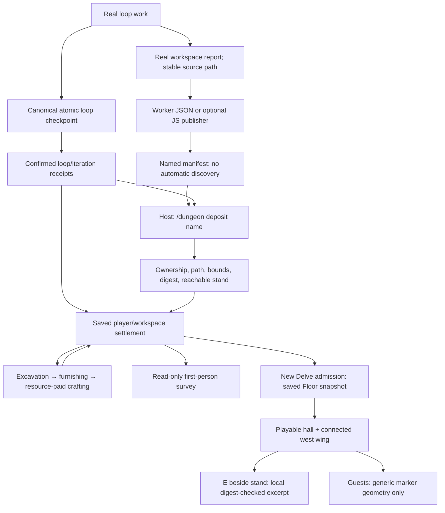

# Connected settlement: loops leave a world behind

[Architecture index](README.md) · [Operations](operations.md) · [Delve guide](../DELVE.md)

**Implemented first slice, not a full colony simulator.** A player's saved site
starts in the existing Undercroft/PLAYER HALL. Long-running loops excavate a west
wing, furnish different rooms, and craft site tools. The passive first-person
survey and new playable Delves use the same saved `Floor`, rather than two
unrelated maps. Workers can leave inspectable objects linked to real local
research reports.

This is a checkout developer guide, not an addition to the public release
allowlist. Source and tests below are authoritative for behavior.

## Try it

1. Run a normal loop in the workspace. Successful canonical loop checkpoints
   associate the player site and record completed iterations. Merely watching
   the camera does not advance construction.
2. Watch the loop's first-person survey: it starts from the hall and visits
   excavation fronts, stockpiles, workshops and quarters. Working poses and
   torchlight animate; saved room/resource state does not advance with time.
3. With no Delve already open, use **`/dungeon settlement`** to visit the site.
   Walk west from the PLAYER HALL. The Winding Stair still leads into the Delve.
   A new **`/dungeon start`** also admits an eligible saved site.
4. If a Delve is already open, finish or deliberately close it first. Admission
   does not replace a running floor. `/dungeon off` ends that run; it is not a
   harmless reload button. Deposited exhibits appear on the next admission.
5. When a worker has written a real report and its manifest, run
   **`/dungeon deposit <name>`** after that iteration is durably saved. The old
   no-name command still reads `.angelX/settlement-exhibits.json`.
6. On a new visit, stand beside **LOCAL RESEARCH** and press **E** (or use
   **`/dungeon inspect`**). Up/down scrolls the local excerpt; E/Esc closes it.
   E retains its combat meaning outside the settlement inspection context.

The worker is given site/loop/iteration identifiers in its loop brief once a
saved site exists. A report is optional: an iteration without a substantive
result should not manufacture one to decorate the world.

## Actual state and data flow



Completed receipts buy work once, including across resume. Failed checkpoint
writes, duplicate frames and replayed receipts cannot award construction. Site
updates lock, validate and atomically replace their own ledger; they do not
write the active Delve checkpoint or mint realm gold. Stock, expenditure and
crafted tools are accounted separately from the playable treasury.

## Worker deposition contract

Write the actual UTF-8 report inside the current workspace, then publish a
distinct `.angelX/settlement-exhibits/<name>.json` with this shape. Use stable,
iteration-specific report paths and do not overwrite published manifests or
sources. The worker brief supplies a deterministic site/loop-digest-plus-iteration
name; names are 1–64 ASCII bytes, beginning with a letter/digit and otherwise
containing only letters, digits, `_` or `-`. Do not pass `.json` in the command.
Substitute the exact identifiers supplied in the brief; placeholders below are
not real IDs. Manually authored JSON needs no helper CLI.

```json
{
  "schema": "angel.settlement-exhibits/v1",
  "site_id": "<saved site id>",
  "loop_id": "<owning loop id>",
  "iteration": 1,
  "artifacts": [
    {
      "key": "latency-investigation-1",
      "title": "Latency investigation",
      "source": "reports/latency-investigation-1.txt",
      "status": "reported"
    }
  ]
}
```

- Deposition is **explicit**; there is no recursive discovery, queue scan, or
  fallback from an absent named file to the legacy manifest. Different batches
  coexist and may be admitted out of order once their receipts are saved. Command
  edge whitespace is normalized; names containing paths, extensions, embedded
  whitespace or extra tokens are rejected before receipt synchronization.
- The iteration must be confirmed in the canonical loop checkpoint and the
  site's receipt ledger. The manifest must name that site and the **currently
  loaded loop**. Retaining an older loop's file does not authorize cross-loop
  admission; load/resume its owning loop first.
- Allowed statuses are `reported`, `inconclusive`, and `failed`. They are **worker
  claims**, not verification receipts. Inspection explicitly says
  **NOT verifier-confirmed**. Writing a report cannot award benchmark success.
- Keys are immutable within a site/loop. Identical redeposition is a no-op;
  changed content or claims require a new key. The source digest is recorded.
- Limits: 16 artifacts per manifest, 32 per site, 64 KiB of UTF-8 per source,
  128-byte titles and 240-byte workspace-relative source paths.
- Traversal, symlink components, hard links, special files and files owned by
  another user are rejected. Sources must still exist with the recorded bytes
  when inspected; changed reports are not silently shown as the old result.
- Inspection presents a redacted, bounded local excerpt (up to 4 KiB). Titles,
  paths, claims and report contents are excluded from guest snapshots and
  shared pixels. Friends can see the generic stand, not private research.
- Exhibit admission is all-or-nothing. Valid commands first synchronize ordinary
  saved construction receipts; that independent sync can succeed even if the
  manifest is subsequently rejected. Capacity limits and invalid sources are
  reported rather than silently dropped.

These are source-linked exhibits, not archived copies of reports. Keep a source
file stable if its exhibit should remain readable. There is no automatic reward
for deposition and no automatic publication of research to friends.

## Optional checkout publisher (Linux)

The small JavaScript helper validates and publishes a complete named manifest
without replacing an existing name:

```bash
node scripts/runtime/settlement-exhibits.mjs publish "$PWD" latency-1 < manifest.json
```

`manifest.json` uses the shape above with real identifiers and already-written
sources. Success prints the relative manifest path and `/dungeon deposit latency-1`.
It does **not** admit exhibits, save loop receipts, grant rewards, start workers,
or mark research verified. The native worker brief remains usable without this
checkout-only helper; it is not added to the public release inventory.

- Pure schema rules live in `lib/settlement/`; the runtime entry owns filesystem
  access and delegates credential checking to the existing private-store helper
  (Python 3). Imports do not run the CLI.
- Sources are bounded UTF-8, singly linked owner files. Linux descriptor-relative
  reads reject symlinks at every component, without directory enumeration.
- Names, manifest metadata and source text undergo credential checks. A detected
  secret is refused, not rewritten; CLI errors do not echo private input.
- New directories use `0700` and manifests `0600`. Existing queue directories
  must be owner-controlled and not group/other-writable; their modes are not
  silently changed. Same-owner malicious processes remain outside this boundary.
- An identical serialized manifest is an idempotent retry. A different manifest
  under the same name is refused. Sources are not copied or made immutable; keep
  them stable. Native admission rechecks them and records their digest.
- Publication stages and syncs a private file, then links it atomically without
  replacement, removes the temporary link, and syncs the queue directory. A crash
  between link and unlink can leave a two-linked manifest; native admission fails
  closed. Inspect and remove the leftover `.name.*.tmp` link before retrying; do
  not erase the report or blindly replay publication. A directory-sync failure
  after publication may report failure even though the complete file exists.

## Implementation map

| Responsibility | Source |
| --- | --- |
| Durable loop confirmation; worker brief | [`loop_ctl.rs`](../../cockpit/src/drive/loop_ctl.rs) |
| Receipt-to-site bridge | [`turn_io.rs`](../../cockpit/src/app/control/turn_io.rs) |
| Site identity, excavation, stock/craft accounting, save transactions | [`together_settlement.rs`](../../cockpit/src/drive/together_settlement.rs) |
| Pure worker-side manifest rules | [`lib/settlement/exhibits.mjs`](../../lib/settlement/exhibits.mjs) |
| Optional immutable publication CLI and filesystem boundary | [`settlement-exhibits.mjs`](../../scripts/runtime/settlement-exhibits.mjs) |
| Native manifest validation, source confinement, exhibit placement/inspection | [`exhibits.rs`](../../cockpit/src/drive/together_settlement/exhibits.rs) |
| Shared room vocabulary and floor construction | [`layout.rs`](../../cockpit/src/drive/together_shooter/layout.rs) |
| Playable hall admission | [`home.rs`](../../cockpit/src/drive/together_shooter/home.rs) |
| Commands and local-only inspection controls | [`dungeon_shooter.rs`](../../cockpit/src/app/control/dungeon_shooter.rs) |
| Camera/site bridge | [`crawl.rs`](../../cockpit/src/stage/world_viz/crawl.rs) |
| Survey paths, work poses and workshop/exhibit staging | [`crawl/settlement.rs`](../../cockpit/src/stage/world_viz/crawl/settlement.rs) |
| Shared collision projection | [`crawl/dungeon.rs`](../../cockpit/src/stage/world_viz/crawl/dungeon.rs) |
| Guest snapshot boundary | [`together_guest.rs`](../../cockpit/src/drive/together_guest.rs) |

Regression coverage is in
[`together_settlement__tests.rs`](../../tests/cockpit/app/together_settlement__tests.rs)
and
[`together_settlement__artifact_tests.rs`](../../tests/cockpit/app/together_settlement__artifact_tests.rs),
with renderer cases beside the scene implementation. The opt-in
`settlement_exhibit_visual_preview_capture` fixture draws real passive/playable
views using fixture report data, not a claim of validated production research.
Publisher coverage lives in
[`settlement-exhibits.test.mjs`](../../tests/scripts/settlement-exhibits.test.mjs)
and is included in `npm run test:workers`.

## Deliberate limits and next seams

- The initial construction schedule has **six rooms**, not unlimited excavation
  or player-selected zoning. Crafting produces durable site tools, not yet
  equippable Delve gear or a full recipe economy.
- The site is player/workspace-owned with per-loop receipts; multiple loops can
  contribute. It is not a separately editable world for every loop.
- Playable Delves take an admission snapshot. Player edits do not yet flow back
  into settlement terrain, and ongoing runs are not live-replaced.
- Named research manifests can coexist, but still require explicit host
  admission; there is no automatic draining, listing, or cross-loop admission.
  Explicit sharing controls and native verifier-linked exhibit status remain
  future work; do not label current worker claims verified.
- This slice keeps model/economy rules separate from camera animation. It does
  not introduce a JS hotloader or move the dungeon simulation out of Rust.
- Long-duration interactive/co-op qualification and optimized release
  qualification are separate from the focused native tests and visual fixture.
