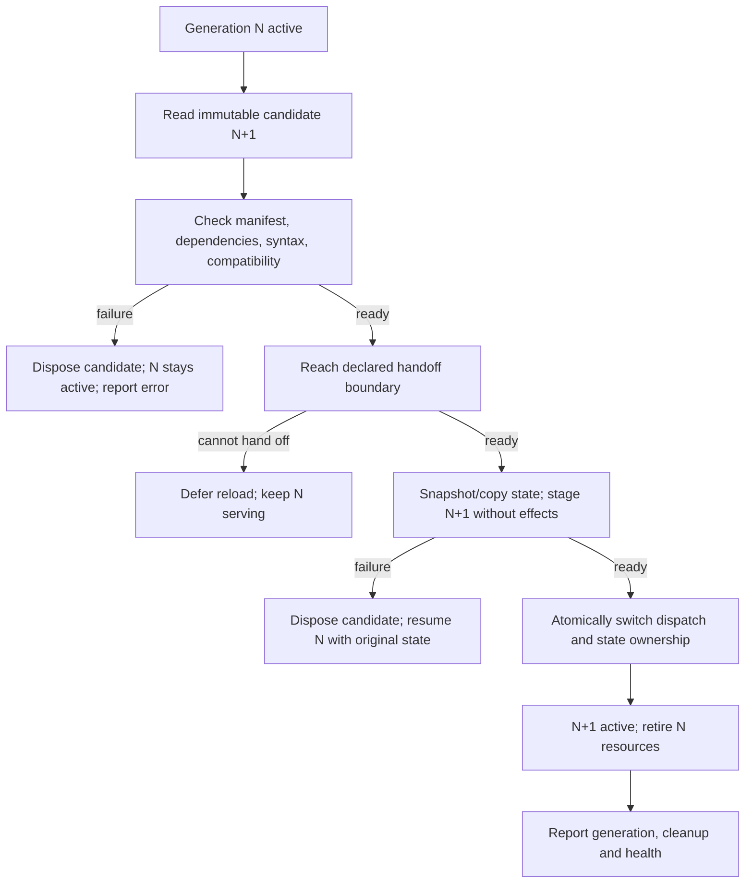

# Lean host and hotloading: boundary proposal

[Architecture index](README.md) · [Current operations](operations.md)

**Status: design proposal, not implemented behavior.** This supports the
operator's more-JavaScript/less-Rust direction. The current-state inventory is
traced at `97d64bc7`; another worktree may already implement a newer design.
Reconcile this document with that implementation before choosing a loader,
transport, manifest spelling or module directory. No second runtime is proposed
as a prerequisite to understanding the first.

## What exists today

| Mechanism | Actual lifecycle | Evidence |
|---|---|---|
| JS tool programs | `code_mode::run` creates an isolate/context for the invocation; host tools are callable from JS | [`agent/code_mode.rs`](../../cockpit/src/agent/code_mode.rs), [`harness/code_mode.rs`](../../cockpit/src/agent/harness/code_mode.rs) |
| Node runtime workers | Entry points execute ticks/CLI work; a new process can read changed code, but this is not live replacement inside an existing worker | [`scripts/runtime/`](../../scripts/runtime/), [worker guide](../WORKERS.md) |
| Surface modules | Native activation, suspension, focus and persisted window state; default TOML manifests are embedded with `include_str!` | [`platform/runtime/mod.rs`](../../cockpit/src/platform/runtime/mod.rs), [`cockpit/modules/`](../../cockpit/modules/) |
| Delve spells/cards | Data-only content delivery; host spell polling skips invalid/partial cards and retries later; manual reload provides diagnostics | [`spells.rs`](../../cockpit/src/drive/together_shooter/spells.rs) (`hot_load_spells`), [`dungeon_reforge.rs`](../../cockpit/src/app/control/dungeon_reforge.rs) |
| Config-only cartridges | Configuration read at startup without rebuilding | [Cartridges](../CARTRIDGES.md#a-config-only-cartridge) |
| Source cartridges | Rust hooks compiled into the binary; changing source needs a rebuild | [`cartridges/`](../../cockpit/src/agent/harness/cartridges/), [source cartridges](../CARTRIDGES.md#a-source-cartridge) |
| Installed runtime resources | Located through a configured root, source-bound installed bundle, checkout or build-time fallback | [`runtime_paths.rs`](../../cockpit/src/platform/runtime_paths.rs), [`release-evidence.mjs`](../../scripts/release/release-evidence.mjs) |

**Content reload, next-process code refresh, surface activation and live code
replacement are four different operations.** None of the first three establishes
a general JS-module hotloader. Existing V8 tool execution and Node workers are
also different execution environments; Node imports cannot simply be assumed to
work in `code_mode`.

## Proposed ownership boundary

Aim for a stable native mechanism layer and replaceable application behavior.
This is a migration hypothesis, not a rule that every current Rust feature must
remain native or that JS necessarily improves every hot path.

| Responsibility | Suggested owner | Boundary requirement |
|---|---|---|
| Terminal lifecycle, low-level input/output, native rendering primitives | Native host initially | JS receives events and submits structured view/state updates, not ownership of terminal teardown |
| Process/PTY handles, provider streams, shared execution resources | Host service initially | Opaque resource IDs and explicit ownership; no pointer-shaped application API |
| Operator authority, workspace identity, action execution and receipts | One authoritative host boundary | Modules use the configured authority; migration neither bypasses it nor adds a new confinement policy |
| Command routing policy, feature composition, report/status projections | JS extraction candidates | Versioned request/result/event shapes, deterministic fixtures |
| Dossier/Habitsmith transforms and related worker policy | JS already in part | Preserve graph writer leases, repo keys and artifact schemas |
| Goals, orchestration and competition-specific behavior | Later JS candidates | Keep in-flight calls, external side effects and durable checkpoints coherent across replacement |
| World/game rules and content composition | Evaluate feature by feature | Measure simulation/frame costs; preserve multiplayer state and deterministic behavior |
| Durable stores and migrations | Explicit owner per store, language-independent | Never let old and new implementations write the same store concurrently |

A small host is a **small stable contract**, not merely a small Rust line count.
Do not move a provider loop first just because it is a large file. Prefer an
already isolated, deterministic transform or status projection whose behavior
can be compared without a network or active model session.

### Contract to settle with the active implementation

For each feature, write down:

- Stable module ID, implementation/content digest and host-contract version.
- Declared dependencies and the immutable dependency generation being loaded.
- Event/request names, payload schemas, result/error shapes and cancellation.
- State owner, state-schema version, empty-state representation and migration.
- Reload boundary: idle only, between requests, or explicitly migratable work.
- Resource ownership: timers, subscriptions, processes, files and writer leases.
- Diagnostic identity: module generation, workspace/run/request IDs and source.

For requests and completions, carry a correlation ID and generation where
applicable. A late event from an old generation must be handled by its owning
request or rejected explicitly, never attached to an unrelated new turn.

Choosing an in-process isolate versus a worker process is still open. The former
needs a proven way to retire the whole generation; the latter needs a transport,
crash handling and clear host/worker process ownership. Do not choose between
them from the word “hotload” alone.

## Proposed reload protocol

This is a logical lifecycle, not prescribed method names or an existing API.



### Invariants and error paths

1. **Preparation is not activation.** Import/validation must not register live
   handlers, schedule jobs, mutate durable stores or issue tool calls. Prepare
   from one immutable dependency set, not a directory changing mid-import.
2. **One reload transaction per module/dependency group.** Coalesce repeated file
   events by content identity. Never publish half of a mutually dependent update.
   An unchanged digest is a no-op; a missing/deleted file is not an implicit
   instruction to unload a working module.
3. **One active dispatch and one state writer.** Stage a candidate without making
   it a second consumer or writer. Switching handlers, generation identity and
   store ownership must have one commit point. Revoke N's dispatch and write
   authority at that point, before admitting work to N+1; asynchronous cleanup
   must not leave N able to mutate the live store. If that cannot be guaranteed,
   defer the handoff rather than allowing overlapping writers.
4. **No replayed work.** By default, a request stays with the generation that
   accepted it; delay replacement until its declared boundary. A long tool call
   or model stream is not canceled merely because a file changed. Migration of
   in-flight work requires an explicit stronger contract, not automatic retry.
5. **Pre-commit failure preserves N.** Syntax/import/version errors, failed state
   conversion and failed staging leave the original state intact. Discard copied
   state and candidate-owned resources; resume admission to N if it was paused.
6. **State conversion is not destructive.** Validate a copied snapshot and stage
   new durable state before committing ownership. Missing state means a defined
   initial state, not a parse error disguised as an empty object. Unsupported
   versions produce a diagnostic, not silent data loss.
7. **Post-commit rollback is not time travel.** Once N+1 has written state or
   caused external effects, pointing back to N may be unsafe. Require a compatible
   schema and reconciled effects, or fail the feature visibly and use its recovery
   path. Never claim to undo an external submission or command by reloading code.
8. **Cleanup has an owner.** Dispose canceled candidates and retired generations:
   subscriptions, timers, temporary snapshots, owned worker processes and leases.
   Cleanup is idempotent; failure is reported, not silently counted as success.
   Long-lived host-owned jobs follow their own lifecycle, not module teardown.
9. **Reload does not erase evidence.** Preserve session/turn IDs, workspace
   identity, verifier receipts and already visible output. Record both old and
   new source identities and the reload outcome without logging credentials.
10. **The host can run without optional modules.** An empty module directory,
    missing optional dependency or disabled feature should have an explicit state.
    A required dependency failure should identify the affected feature, not hang
    startup or pretend that a request completed.

Node's module cache is a particular implementation concern: adding a query
parameter to one `import()` is not proof of transitive dependency refresh or
cleanup. A replacement needs a coherent generation boundary, whether achieved
with disposable workers, isolates or another verified mechanism.

## Acceptance matrix

**Required future coverage, not tests supplied by this documentation patch.**
Use the active loader's test entry point and extend its existing fixtures when
implementing. The [current test map](operations.md#test-entry-points) identifies
behavior that must survive extraction.

| Scenario | Observable acceptance |
|---|---|
| Valid replacement while idle | New behavior appears without a native rebuild or host restart; generation/source identity changes |
| Syntax error, missing dependency or incompatible host API | Diagnostic identifies candidate; old behavior and state remain usable |
| Partial save, duplicate watch event, rapid consecutive edits | No partial generation; no duplicate activation; latest accepted digest is observable |
| Transitive dependency changes | All code belongs to the intended dependency snapshot; no old/new import mixture |
| Invalid, missing or incompatible persisted state | Defined initialization or explicit refusal; prior state is not overwritten |
| Reload during model/tool request | Owning generation completes or reload defers; request and side effects are not repeated |
| Late event after handoff | Routed to its original owner or explicitly discarded; cannot corrupt new state |
| Candidate init throws or cleanup is called twice | No leaked handlers, timers, subprocesses or writer leases |
| Active worker crashes or fails after committing effects | Failure surfaces; recovery reconciles state/effects rather than blindly replaying |
| Repeated reloads and final shutdown | Measured resource counts settle; terminal/session shutdown remains owned and complete |
| Empty directory, module removal or disabled module | Explicit state; no accidental unload from a transient filesystem observation |
| Installed bundle without the producing checkout | Feature and dependencies resolve from shipped resources; identity and compatibility remain inspectable |

Measure **edit-to-activation latency**, native rebuilds avoided, reload failures,
resource growth and behavior parity. Keep baseline/candidate settings explicit.
Do not use a faster fresh startup as evidence of successful live replacement.

## First extraction: dossier core

**Implemented organization change, not a hotloader:**

```text
native dossier reader (unchanged)
    <- published JSON <- scripts/runtime/repo-dossier.mjs
                             | paths, caps, redaction, filesystem I/O, writer lease
                             v
                       lib/dossier/core.mjs
                             | mining, graph folding, beliefs, projections
                             +-> lib/research/CausalGraph.js
                             +-> lib/research/causal-loop.mjs
                             +-> lib/evidence/authored-write.mjs
```

The [core](../../lib/dossier/core.mjs) imports only reusable libraries, not Node
builtins, workers or store configuration. It mutates only the caller-supplied
graph; callers own persistence and supply `opts.now` when reproducibility matters.
It neither acquires a lease nor schedules work on import. Store-cap enforcement
and redaction remain at the worker's publication boundary.

The old [worker module](../../scripts/runtime/repo-dossier.mjs) re-exports the
same core bindings and retains its CLI/path/publication API. Scoring and evidence
also retain compatibility entry points under `scripts/runtime/`. There is one
implementation per behavior, not parallel worker/library versions.

Existing [dossier tests](../../tests/scripts/repo-dossier.test.mjs) exercise the
core directly and check the compatibility bindings. The bundled-worker smoke
copies the declared runtime resources into a temporary bundle before launching
the CLIs; it checks import closure, publishes a dossier, lists mined workflows,
and writes a habit draft without a producing checkout beside the workers. It
also checks the proposal budget and that drafts are not installed. The release
inventory explicitly includes the new library files. This does not qualify a
native release or prove live replacement.

This is a smaller future reload target than a provider stream, outer loop or live
multiplayer simulation. Graph ownership and the native reader are unchanged.

## Second extraction: habits and probe rules

[`habits/core.mjs`](../../lib/habits/core.mjs) now owns sequence mining, draft
rendering/deduplication, feedback folding and drift projections. It imports the
dossier core and [`dossier/probes.mjs`](../../lib/dossier/probes.mjs), not the
scheduled dossier worker. The probe library turns supplied observations into
verdicts and updates an in-memory graph; it does not execute commands or read
the environment.

```text
scripts/runtime/habitsmith.mjs       CLI and proposal-file publication
scripts/runtime/habitsmith-tick.mjs  scheduling, gates, spool and status persistence
              |
              v
       lib/habits/core.mjs
              +-> lib/dossier/core.mjs
              +-> lib/dossier/probes.mjs <- scripts/runtime/dossier-tick.mjs
                          |
                          v
                lib/research/causal-loop.mjs
```

Worker compatibility exports remain. Empty inputs, proposal-only behavior,
perpetual fact status, repo-scoped feedback, daily budget handling and cleanup
retain their existing implementations. Existing Habitsmith/probe tests import
the libraries directly and check that the old exports refer to the same bindings.
No worker is started simply to reuse its rules.

## Handoff to the active hotloader

Before integrating this core with a live loader, resolve these with its owner:

1. Which branch/worktree and loader are authoritative? Is there already a module
   manifest and lifecycle API to reuse?
2. Which execution environment hosts modules, and how does it retire a dependency
   generation completely?
3. Which component owns dispatch, state persistence and reload commit/recovery?
4. Which resource bundle and compatibility version ship the module?
5. Which existing verifier demonstrates reload and failure recovery?

Keep this workstream on maps, contracts and a small feature extraction; avoid
parallel edits to an unknown loader. Update this proposal to the actual contract
once that implementation is available.
