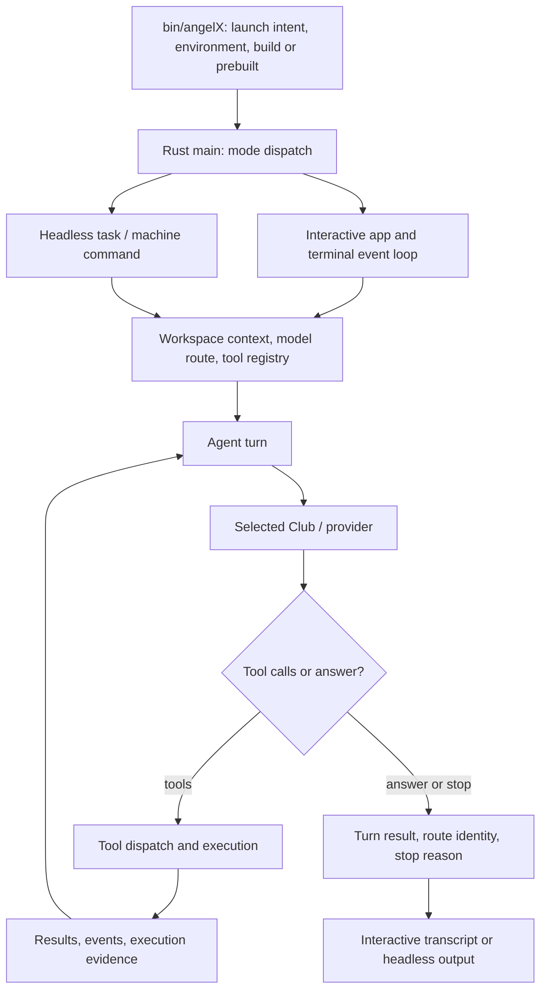
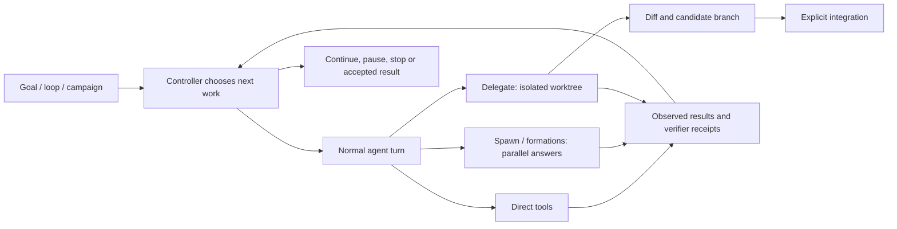
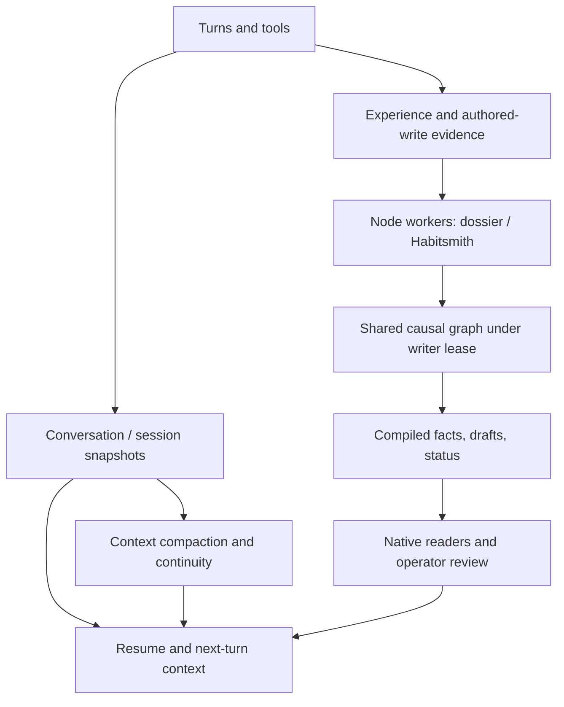
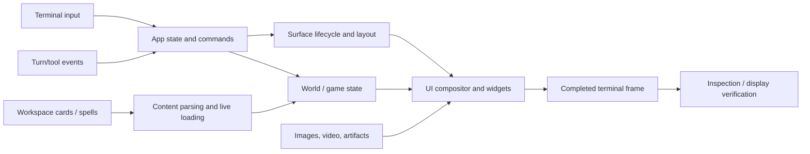
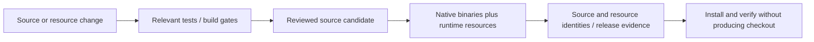

# Software operations and workflows

[Architecture index](README.md) · [Hotloading proposal](lean-host.md) ·
[User commands](../COMMANDS.md)

**Current-state schematic, traced at `97d64bc7`.** The diagrams group operation
families; they are not a claim that every feature has its own process. Arrows
mean control or data flow, not Rust import dependencies. Sources below are the
entry points for following each path. Runtime policy depends on the selected
operator profile; a diagram does not add new approval or execution restrictions.

**Incremental changes after that baseline:** dossier behavior and probe rules now
live in `lib/dossier/`, and workflow behavior in `lib/habits/core.mjs`. Existing
CLI paths and native consumers are preserved. The worker links below reflect
these extractions. No general hotloader is implied.

## Launch and agent turns

The launcher and native entry point also handle setup, inspection and other
machine modes; not every invocation starts a model. Interactive turns run off
the UI thread. A selected route can change while a turn is running, so the turn
retains its own route identity and event/result channels.

| Step | Source entry point / contract |
|---|---|
| Launch and resource selection | [`bin/angelX`](../../bin/angelX), [`interactive_launch.rs`](../../cockpit/src/interactive_launch.rs), [`runtime_paths.rs`](../../cockpit/src/platform/runtime_paths.rs) |
| Mode dispatch, including headless work | [`main.rs`](../../cockpit/src/main.rs), [`app/launch.rs`](../../cockpit/src/app/launch.rs) |
| Workspace context and model selection | [`bootstrap.rs`](../../cockpit/src/app/bootstrap.rs), [`club/`](../../cockpit/src/agent/club/), [`workspace_store/`](../../cockpit/src/platform/workspace_store/) |
| Input and slash commands | [`ui/input.rs`](../../cockpit/src/ui/input.rs), [`control/commands.rs`](../../cockpit/src/app/control/commands.rs) |
| Spawn and harvest a turn | [`control/turn_io.rs`](../../cockpit/src/app/control/turn_io.rs), [`agent/turn.rs`](../../cockpit/src/agent/turn.rs) (`Thinking`) |
| Model/tool iteration | [`harness/turn/mod.rs`](../../cockpit/src/agent/harness/turn/mod.rs), [`club/http.rs`](../../cockpit/src/agent/club/http.rs) |
| Tool definitions and registration | [`registry.rs`](../../cockpit/src/agent/harness/registry.rs) (`ToolRegistry`), [`registration.rs`](../../cockpit/src/agent/harness/registration.rs), [`tools/`](../../cockpit/src/agent/tools/) |
| Execution and configured authority | [`exec/`](../../cockpit/src/agent/harness/exec/), [`approval.rs`](../../cockpit/src/agent/approval.rs), [`platform/yolo.rs`](../../cockpit/src/platform/yolo.rs) |
| Content-checked editing | [`tools/file.rs`](../../cockpit/src/agent/tools/file.rs), [`hashline.rs`](../../cockpit/src/agent/hashline.rs), [`staged_edit.rs`](../../cockpit/src/agent/staged_edit.rs) |
| JS tool programs | [`agent/code_mode.rs`](../../cockpit/src/agent/code_mode.rs) (`run`), [`harness/code_mode.rs`](../../cockpit/src/agent/harness/code_mode.rs) |
| External services and research | [`mcp.rs`](../../cockpit/src/agent/mcp.rs), [`lsp/`](../../cockpit/src/agent/lsp/), [`tools/web.rs`](../../cockpit/src/agent/tools/web.rs), [`tools/proc.rs`](../../cockpit/src/agent/tools/proc.rs) |

`code_mode` creates a V8 isolate/context for a tool program and exposes tool
calls to it. This is not, by itself, a long-lived reloadable JS module host.

## Orchestration and long-running work

These are distinct mechanisms, not interchangeable names for one scheduler:

| Operation | Responsibilities and implementation |
|---|---|
| Goal and outer loop | [`goal.rs`](../../cockpit/src/drive/goal.rs) owns the objective; [`loop_ctl.rs`](../../cockpit/src/drive/loop_ctl.rs) advances successive turns; [`iterate.rs`](../../cockpit/src/drive/iterate.rs) holds shared iteration logic |
| In-turn deliberation and formations | [`deli.rs`](../../cockpit/src/drive/deli.rs), [`swarm/`](../../cockpit/src/agent/swarm/), [`formations.rs`](../../cockpit/src/agent/formations.rs) |
| Parallel seat consultation | [`harness/spawn.rs`](../../cockpit/src/agent/harness/spawn.rs); not the branch-integration workflow |
| Delegate and integrate | [`harness/orchestrator.rs`](../../cockpit/src/agent/harness/orchestrator.rs), [`agent/git/`](../../cockpit/src/agent/git/); worktree output is separate from landing it |
| Explicit agent graphs | [`harness/agent_graph.rs`](../../cockpit/src/agent/harness/agent_graph.rs), [`drive/graph_ctl.rs`](../../cockpit/src/drive/graph_ctl.rs) |
| Proof-carrying candidate workflow | [`swarm_compile/`](../../cockpit/src/agent/harness/swarm_compile/) separates investigation, regression, implementation, verification and review; see its `stages.rs`, `verify.rs` and `finalize.rs` |
| Campaign and competition coordination | [`campaign/`](../../cockpit/src/drive/campaign/), [`competition/`](../../cockpit/src/drive/competition/); [runner contract](../../cockpit/docs/COMPETITION_RUNNER.md) |
| Competition-specific hooks | [`cartridges/`](../../cockpit/src/agent/harness/cartridges/); [cartridge guide](../CARTRIDGES.md) distinguishes startup configuration from compiled source cartridges |
| Research and reinforcement controllers | [`reinforce.rs`](../../cockpit/src/drive/reinforce.rs), [`rl_ctl/`](../../cockpit/src/drive/rl_ctl/), [`self_loop.rs`](../../cockpit/src/drive/self_loop.rs), [`conductor.rs`](../../cockpit/src/drive/conductor.rs), [`science.rs`](../../cockpit/src/drive/science.rs) |

An answer, a parked branch, a successful integration and a verified outcome are
different events. Preserve that distinction in any JS extraction. A reload must
not silently restart a model request, repeat a submission or promote a candidate.

## State, knowledge and presentation

### State and worker feedback

- **Session state:** [`session.rs`](../../cockpit/src/knowledge/session.rs) and
  [`control/session_meta.rs`](../../cockpit/src/app/control/session_meta.rs).
  Persistence is distinct from live worker ownership; see the
  [session overview](../../cockpit/README.md#whats-here) for queued-write caveats.
- **Context lifecycle:** [`compaction.rs`](../../cockpit/src/agent/compaction.rs),
  [`harness/compact.rs`](../../cockpit/src/agent/harness/compact.rs),
  [`compactor.rs`](../../cockpit/src/agent/harness/compactor.rs),
  [`recall.rs`](../../cockpit/src/agent/harness/recall.rs) and
  [`book/`](../../cockpit/src/agent/harness/book/).
- **Knowledge stores:** [`memory/`](../../cockpit/src/knowledge/memory/),
  [`atlas/`](../../cockpit/src/knowledge/atlas/),
  [`caddy/`](../../cockpit/src/knowledge/caddy/),
  [`experience.rs`](../../cockpit/src/knowledge/experience.rs) and
  [`cut/`](../../cockpit/src/knowledge/cut/). See [memory](../MEMORY.md).
- **Existing cross-language seam:** native
  [`dossier.rs`](../../cockpit/src/knowledge/dossier.rs) consumes artifacts from
  [`repo-dossier.mjs`](../../scripts/runtime/repo-dossier.mjs). The worker owns
  paths, publication and the graph lease; the reusable
  [`dossier core`](../../lib/dossier/core.mjs) owns mining, in-memory graph updates,
  beliefs and projections. Native
  [`habits.rs`](../../cockpit/src/drive/habits.rs) participates in the workflow
  folded by [`habitsmith-tick.mjs`](../../scripts/runtime/habitsmith-tick.mjs).
  [`habits/core.mjs`](../../lib/habits/core.mjs) owns sequence mining, draft
  rendering, approval feedback and drift projections; shared
  [`dossier/probes.mjs`](../../lib/dossier/probes.mjs) applies in-memory probe
  transitions without importing the scheduled dossier worker. Filesystem
  publication and budget persistence stay in
  [`habitsmith.mjs`](../../scripts/runtime/habitsmith.mjs).
  Node owns the shared graph; Rust does not independently mutate that graph.
- **Worker coordination:** [`worker-lock.mjs`](../../scripts/runtime/worker-lock.mjs),
  [`process-lease.mjs`](../../lib/control/process-lease.mjs),
  [`worker-paths.mjs`](../../scripts/runtime/worker-paths.mjs) and
  [`private-store-fs.mjs`](../../scripts/runtime/private-store-fs.mjs).
  [Worker operations](../WORKERS.md) specifies scheduling, outputs and overrides.
  Installing angelX does not automatically schedule every documented worker.

Recalled evidence is input to research, not proof that the current tree passed a
check. Module replacement must retain repo identity and provenance in these flows.

### Terminal, world, media and the Delve

The [connected settlement workflow](connected-settlement.md#actual-state-and-data-flow)
adds a durable projection of saved loop receipts into the existing player
hall: excavation, room furnishing and site-tool crafting. The passive camera and
new playable Delves consume the same saved floor. Explicitly deposited worker
reports can publish distinct named manifests (optionally through the checkout JS
publisher), then become digest-bound local exhibits through explicit host
admission; guest views contain only generic
exhibit geometry. Rendering still cannot advance work, and model-written report
status is not verifier evidence. Active runs retain their admitted map until a
new run.

- **Render/input ownership:** [`main.rs`](../../cockpit/src/main.rs),
  [`ui/draw/`](../../cockpit/src/ui/draw/),
  [`ui/term/`](../../cockpit/src/ui/term/) and
  [`platform/runtime/`](../../cockpit/src/platform/runtime/). Surface
  activation/suspension is not JS code replacement.
- **World and media:** [`world_viz/`](../../cockpit/src/stage/world_viz/),
  [`raytrace.rs`](../../cockpit/src/stage/raytrace.rs),
  [`scryglass/`](../../cockpit/src/ui/scryglass/),
  [`viewer.rs`](../../cockpit/src/ui/viewer.rs),
  [`observatory.rs`](../../cockpit/src/app/observatory.rs).
- **Co-op and game execution:** [`together.rs`](../../cockpit/src/drive/together.rs),
  [`together_guest.rs`](../../cockpit/src/drive/together_guest.rs),
  [`together_join.rs`](../../cockpit/src/drive/together_join.rs),
  [`together_shooter/`](../../cockpit/src/drive/together_shooter/).
- **Live content:** [`dungeon_shooter.rs`](../../cockpit/src/app/control/dungeon_shooter.rs)
  calls the spell loader in
  [`spells.rs`](../../cockpit/src/drive/together_shooter/spells.rs);
  [`dungeon_reforge.rs`](../../cockpit/src/app/control/dungeon_reforge.rs) handles
  related card workflows. See [Delve operations](../DELVE.md).
- **Display evidence:** [`ui_inspect.rs`](../../cockpit/src/ui/ui_inspect.rs) and
  [`visual_export.rs`](../../cockpit/src/ui/visual_export.rs). Display-only
  verification is not a verifier for tool execution or a campaign result.

## Development and release

Start with [CONTRIBUTING](../../CONTRIBUTING.md),
[`check-cockpit-fast.sh`](../../scripts/check/check-cockpit-fast.sh),
[`package.json`](../../package.json) and the [test guide](../../tests/README.md).
For packaging, follow [release evidence](../release-evidence.md), not a copied
command list in this architecture map. The implementation is
[`release-evidence.mjs`](../../scripts/release/release-evidence.mjs), with
[`build-prebuilt.sh`](../../scripts/release/build-prebuilt.sh) and the release
verification scripts beside it.

JS/Python helpers are shipped resources. Their import graph and the native
[`runtime_paths.rs`](../../cockpit/src/platform/runtime_paths.rs) resolver must
agree with the packaged inventory. Moving a helper is therefore an installation
change as well as a source-layout change.

### Test entry points

These are **existing test sources to consult**, not claims that they were run or
that they already cover the proposed hotloader. Rust test filenames are not
necessarily Cargo filter names; follow their `#[path]` wiring.

| Seam | Existing coverage entry points |
|---|---|
| JS tool execution | [`tests__code_mode.rs`](../../tests/cockpit/harness/tests__code_mode.rs) |
| Delegate/worktree behavior | [`tests__delegate.rs`](../../tests/cockpit/harness/tests__delegate.rs), [`tests__delegated_lineage.rs`](../../tests/cockpit/harness/tests__delegated_lineage.rs) |
| Outer loop | [`loop_ctl__tests.rs`](../../tests/cockpit/loop_ctl/loop_ctl__tests.rs) |
| Sessions | [`session__tests.rs`](../../tests/cockpit/app/session__tests.rs), [`session__process_fault_tests.rs`](../../tests/cockpit/app/session__process_fault_tests.rs) |
| Native surface lifecycle | [`runtime__mod__tests.rs`](../../tests/cockpit/app/runtime__mod__tests.rs) |
| Resource lookup | [`runtime_paths__tests.rs`](../../tests/cockpit/app/runtime_paths__tests.rs) |
| Dossier bridge | [`dossier__tests.rs`](../../tests/cockpit/app/dossier__tests.rs), [`repo-dossier.test.mjs`](../../tests/scripts/repo-dossier.test.mjs), [`dossier-tick.test.mjs`](../../tests/scripts/dossier-tick.test.mjs) |
| Habits and graph writer lease | [`habitsmith.test.mjs`](../../tests/scripts/habitsmith.test.mjs), [`process-lease.test.mjs`](../../tests/scripts/process-lease.test.mjs) |
| Cartridge hooks | [`cartridges__tests.rs`](../../tests/cockpit/harness/cartridges__tests.rs) |
| Delve content and execution | [`together_cards__tests.rs`](../../tests/cockpit/app/together_cards__tests.rs), [`together_shooter__tests.rs`](../../tests/cockpit/app/together_shooter__tests.rs) |
| Packaging and installation | [`release-evidence.test.mjs`](../../tests/scripts/release-evidence.test.mjs), [`verify-release-install.test.mjs`](../../tests/scripts/verify-release-install.test.mjs) |
