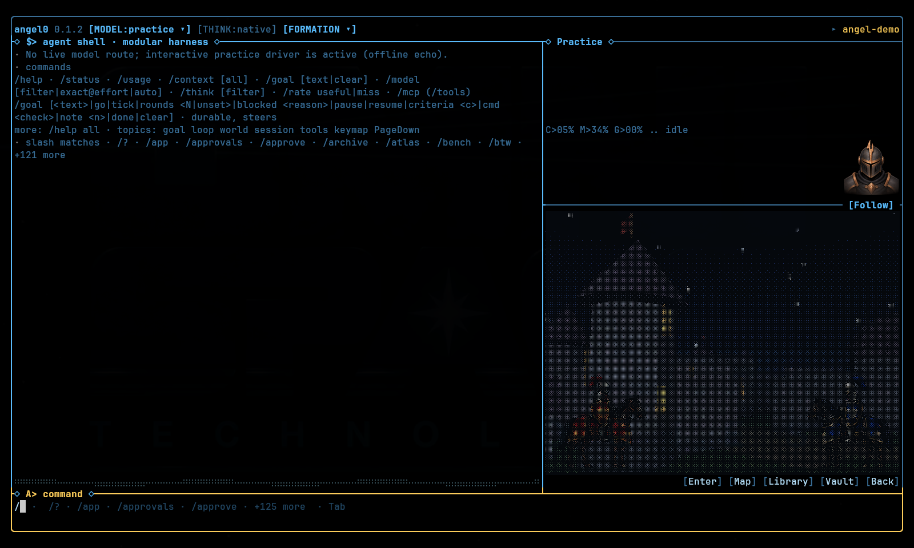
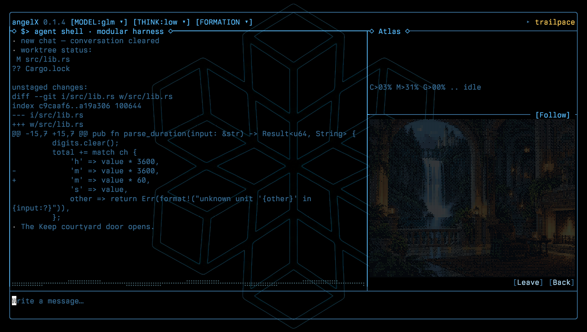

# Usage images

Unedited captures of the running terminal cockpit in Kitty, 1600 × 960.
The startup image uses a fresh workspace with Grok selected and no prompt
submitted. The other captures use the offline `practice` route and local
commands. The arithmetic patch was prepared outside the model. [Capture details and hashes](provenance.json).

| Image | Shown behavior |
|---|---|
| [Startup](intro.png) | Raised Excalibur and the wizard on the summit. |
| [Code diff](cockpit.png) | `/diff` displays a real local Rust change. |
| [Command completion](command-picker.png) | `/help`, then `/` and `Tab`. |
| [World and room view](world.png) | `/world enter` opens the Keep courtyard alongside the code diff. |

